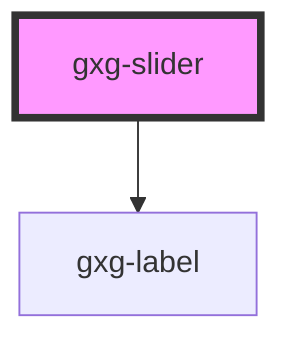

# gxg-slider

<!-- Auto Generated Below -->

## Properties

| Property   | Attribute   | Description                                          | Type      | Default   |
| ---------- | ----------- | ---------------------------------------------------- | --------- | --------- |
| `disabled` | `disabled`  | The state of the slider, whether is disabled or not. | `boolean` | `false`   |
| `label`    | `label`     | The label                                            | `string`  | `"Label"` |
| `max`      | `max`       | The max. value                                       | `number`  | `100`     |
| `maxWidth` | `max-width` | The slider max. width                                | `string`  | `"100%"`  |
| `value`    | `value`     | The initial value                                    | `number`  | `0`       |

## Dependencies

### Depends on

- [gxg-label](../label)

### Graph

---

_Built with [StencilJS](https://stenciljs.com/)_
