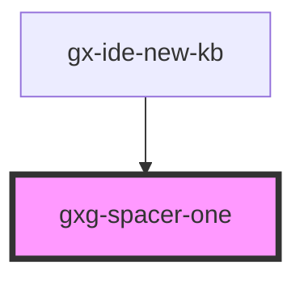

# gxg-spacer-one

<h2>Notes</h2>
<ul><li>The purpose of the <code>gxg-spacer-one</code> is to provide spacing between two components. Just put <code>gxg-spacer-one</code> between the components and set the desired spacing by providing on of the available values on the <code>space</code> property</li>
</ul>

<!-- Auto Generated Below -->

## Properties

| Property | Attribute | Description                                                     | Type     | Default     |
| -------- | --------- | --------------------------------------------------------------- | -------- | ----------- |
| `space`  | `space`   | The spacing value, taken from the "token-spacing" global values | `string` | `undefined` |

## Dependencies

### Used by

- [gx-ide-new-kb](../gx-ide-new-kb)

### Graph

---

_Built with [StencilJS](https://stenciljs.com/)_
