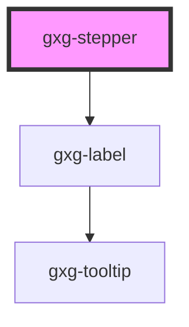

# gxg-stepper

<!-- Auto Generated Below -->

## Properties

| Property        | Attribute        | Description                                           | Type                                     | Default     |
| --------------- | ---------------- | ----------------------------------------------------- | ---------------------------------------- | ----------- |
| `disabled`      | `disabled`       | The state of the stepper, whether is disabled or not. | `boolean`                                | `false`     |
| `label`         | `label`          | The label                                             | `string`                                 | `undefined` |
| `labelPosition` | `label-position` | The label position                                    | `"above" \| "below" \| "end" \| "start"` | `"above"`   |
| `max`           | `max`            | The max. value                                        | `number`                                 | `10000`     |
| `min`           | `min`            | The min. value                                        | `number`                                 | `0`         |
| `value`         | `value`          | The initial vaule                                     | `number`                                 | `0`         |

## Events

| Event          | Description | Type               |
| -------------- | ----------- | ------------------ |
| `stepperInput` |             | `CustomEvent<any>` |

## Dependencies

### Depends on

- [gxg-label](../label)

### Graph

----------------------------------------------

*Built with [StencilJS](https://stenciljs.com/)*
