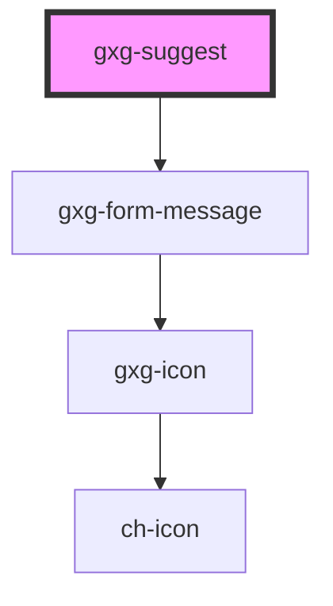

# gxg-suggest

<!-- Auto Generated Below -->

## Properties

| Property            | Attribute            | Description                                                | Type                                                   | Default           |
| ------------------- | -------------------- | ---------------------------------------------------------- | ------------------------------------------------------ | ----------------- |
| `disabled`          | `disabled`           | The presence of this attribute makes the suggest disabled. | `boolean`                                              | `false`           |
| `validationMessage` | `validation-message` | The message to display for the validation result.          | `string`                                               | `undefined`       |
| `validationStatus`  | `validation-status`  | The validation status                                      | `"error" \| "indeterminate" \| "success" \| "warning"` | `"indeterminate"` |

## Dependencies

### Depends on

- [gxg-form-message](../form-message)

### Graph

---

_Built with [StencilJS](https://stenciljs.com/)_
