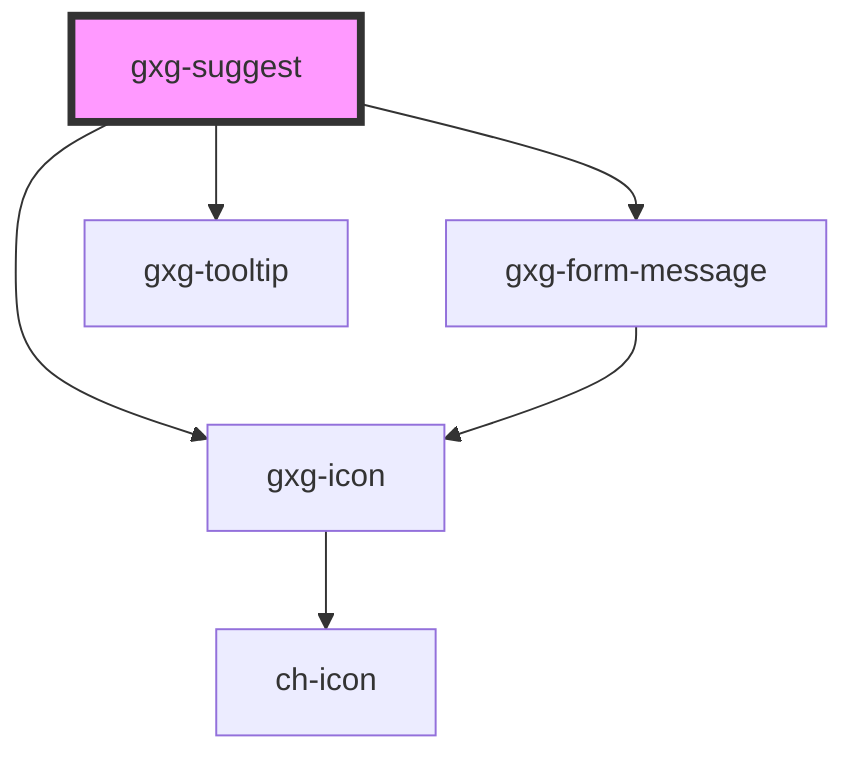

# gxg-suggest

<!-- Auto Generated Below -->

## Properties

| Property            | Attribute            | Description                                                                                                                    | Type                                                   | Default           |
| ------------------- | -------------------- | ------------------------------------------------------------------------------------------------------------------------------ | ------------------------------------------------------ | ----------------- |
| `disabled`          | `disabled`           | The presence of this attribute makes the suggest disabled.                                                                     | `boolean`                                              | `false`           |
| `ellipsis`          | `ellipsis`           | The presence of this attribute forces the suggest list items to not wrap to a second line, and it will display ellipsis. (...) | `boolean`                                              | `true`            |
| `validationMessage` | `validation-message` | The message to display for the validation result.                                                                              | `string`                                               | `undefined`       |
| `validationStatus`  | `validation-status`  | The validation status                                                                                                          | `"error" \| "indeterminate" \| "success" \| "warning"` | `"indeterminate"` |

## Dependencies

### Depends on

- [gxg-form-message](../form-message)
- [gxg-tooltip](../tooltip)
- [gxg-icon](../icon)

### Graph

----------------------------------------------

*Built with [StencilJS](https://stenciljs.com/)*
