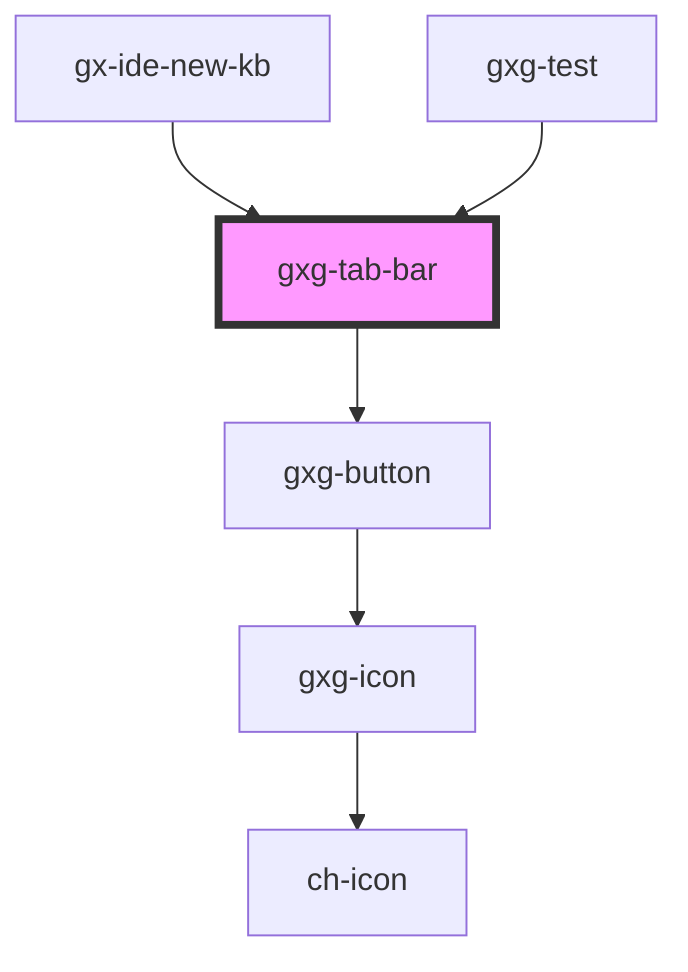

# dt-tab-bar

<!-- Auto Generated Below -->

## Dependencies

### Used by

- [gx-ide-new-kb](../gx-ide-new-kb)
- [gxg-test](../test)

### Depends on

- [gxg-button](../button)

### Graph

---

_Built with [StencilJS](https://stenciljs.com/)_
