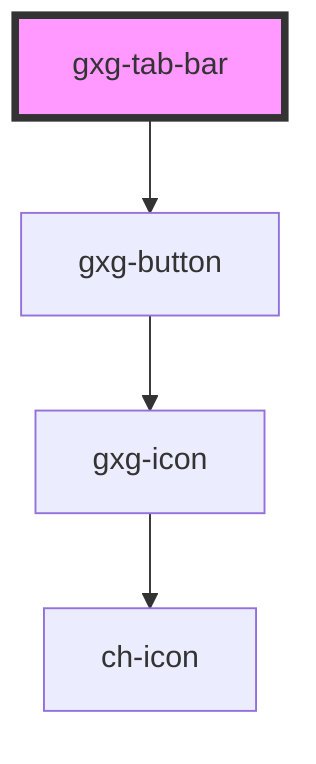

# dt-tab-bar

<!-- Auto Generated Below -->

## Properties

| Property        | Attribute        | Description                                                                                                           | Type      | Default |
| --------------- | ---------------- | --------------------------------------------------------------------------------------------------------------------- | --------- | ------- |
| `displayBorder` | `display-border` | The presence of this attribute displays a border-bottom line on the tab bar                                           | `boolean` | `false` |
| `hidden`        | `hidden`         | Hides the tab-bar                                                                                                     | `boolean` | `false` |
| `scrollable`    | `scrollable`     | The presence of this attribute with display a scrollbar if the buttons total width is greater than the tab-bar width. | `boolean` | `false` |

## Methods

### `appendTabButtons() => Promise<void>`

#### Returns

Type: `Promise<void>`

## Dependencies

### Depends on

- [gxg-button](../button)

### Graph

---

_Built with [StencilJS](https://stenciljs.com/)_
