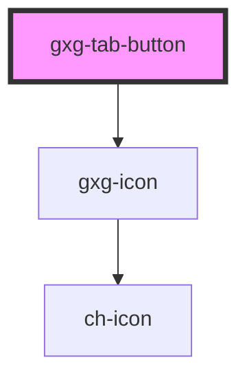

# gxg-tab-button

<!-- Auto Generated Below -->

## Properties

| Property       | Attribute       | Description                                                                                | Type      | Default |
| -------------- | --------------- | ------------------------------------------------------------------------------------------ | --------- | ------- |
| `borderAbove`  | `border-above`  | Displays the border above                                                                  | `boolean` | `false` |
| `disabled`     | `disabled`      | Provide this attribute to make this button disabled                                        | `boolean` | `false` |
| `hidden`       | `hidden`        | Hides the tab button                                                                       | `boolean` | `false` |
| `icon`         | `icon`          | (Optional) provide an icon to this button                                                  | `string`  | `null`  |
| `isSelected`   | `is-selected`   | Provide this attribute to make this button selected by default                             | `boolean` | `false` |
| `noIndicator`  | `no-indicator`  | If true, the tab-button border indicator will not be displayed                             | `boolean` | `false` |
| `reduced`      | `reduced`       | The presence of this attribute will hide the icon, and reduce the font size a little bit.  | `boolean` | `false` |
| `stackedStyle` | `stacked-style` | Stylize the button for the gxg-tab-bar "stacked" version.                                  | `boolean` | `false` |
| `tab`          | `tab`           | The tab id. Must be unique, and match the "tab" value of the correlative "gxg-tab" element | `string`  | `null`  |
| `tabLabel`     | `tab-label`     | The button label                                                                           | `string`  | `null`  |

## Events

| Event           | Description | Type               |
| --------------- | ----------- | ------------------ |
| `PrevOrNextTab` |             | `CustomEvent<any>` |
| `tabActivated`  |             | `CustomEvent<any>` |

## Methods

### `tabButtonClick() => Promise<void>`

#### Returns

Type: `Promise<void>`

## Shadow Parts

| Part            | Description |
| --------------- | ----------- |
| `"button-text"` |             |
| `"icon"`        |             |

## Dependencies

### Depends on

- [gxg-icon](../icon)

### Graph

----------------------------------------------

*Built with [StencilJS](https://stenciljs.com/)*
