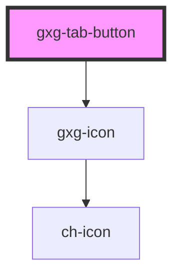

# gxg-tab-button

<!-- Auto Generated Below -->

## Properties

| Property     | Attribute     | Description                                                                   | Type      | Default |
| ------------ | ------------- | ----------------------------------------------------------------------------- | --------- | ------- |
| `disabled`   | `disabled`    | Provide this attribute to make this button disabled                           | `boolean` | `false` |
| `icon`       | `icon`        | (Optional) provide an icon to this button                                     | `string`  | `null`  |
| `isSelected` | `is-selected` | Provide this attribute to make this button selected by default                | `boolean` | `false` |
| `tab`        | `tab`         | The tab id. Should match the "tab" value of the correlative "gxg-tab" element | `string`  | `null`  |
| `tabLabel`   | `tab-label`   | The button label                                                              | `string`  | `null`  |

## Events

| Event          | Description | Type               |
| -------------- | ----------- | ------------------ |
| `tabActivated` |             | `CustomEvent<any>` |

## Dependencies

### Depends on

- [gxg-icon](../icon)

### Graph

---

_Built with [StencilJS](https://stenciljs.com/)_
