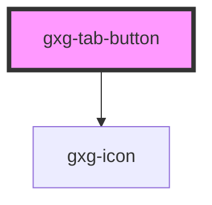

# dt-tab-button

<!-- Auto Generated Below -->

## Properties

| Property     | Attribute     | Description | Type                                                                                                                                                                                                                                                                                                                                                                                                                                                    | Default |
| ------------ | ------------- | ----------- | ------------------------------------------------------------------------------------------------------------------------------------------------------------------------------------------------------------------------------------------------------------------------------------------------------------------------------------------------------------------------------------------------------------------------------------------------------- | ------- |
| `disabled`   | `disabled`    |             | `boolean`                                                                                                                                                                                                                                                                                                                                                                                                                                               | `false` |
| `icon`       | `icon`        |             | `"more-info" \| "error" \| "warning" \| "success" \| "none" \| "add" \| "add-circle" \| "arrow-down" \| "arrow-left" \| "arrow-right" \| "arrow-up" \| "chevron-down" \| "chevron-left" \| "chevron-right" \| "chevron-up" \| "close" \| "color-picker" \| "deleted" \| "drag" \| "duplicate" \| "edit-wand" \| "edit" \| "empty" \| "level-down" \| "level-up" \| "reset" \| "search" \| "settings" \| "show-more-horizontal" \| "show-more-vertical"` | `null`  |
| `isSelected` | `is-selected` |             | `boolean`                                                                                                                                                                                                                                                                                                                                                                                                                                               | `false` |
| `tab`        | `tab`         |             | `string`                                                                                                                                                                                                                                                                                                                                                                                                                                                | `null`  |
| `tabLabel`   | `tab-label`   |             | `string`                                                                                                                                                                                                                                                                                                                                                                                                                                                | `null`  |

## Events

| Event          | Description | Type               |
| -------------- | ----------- | ------------------ |
| `tabActivated` |             | `CustomEvent<any>` |

## Dependencies

### Depends on

- [gxg-icon](../icon)

### Graph

---

_Built with [StencilJS](https://stenciljs.com/)_
