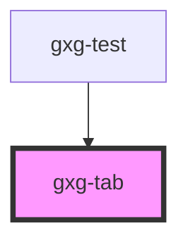

# gxg-tab

<!-- Auto Generated Below -->

## Properties

| Property     | Attribute     | Description                                                           | Type      | Default     |
| ------------ | ------------- | --------------------------------------------------------------------- | --------- | ----------- |
| `isSelected` | `is-selected` | The selected tab                                                      | `boolean` | `false`     |
| `noPadding`  | `no-padding`  | The presence of this attribute removes the tab .container padding     | `boolean` | `false`     |
| `tab`        | `tab`         | The tab id. Should match the "tab" value of the correlative "gxg-tab" | `string`  | `undefined` |

## Dependencies

### Used by

- [gxg-test](../test)

### Graph

---

_Built with [StencilJS](https://stenciljs.com/)_
