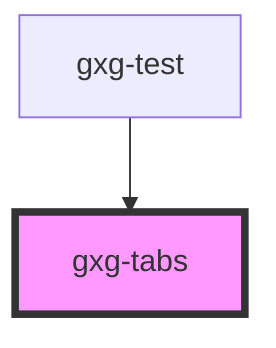

# gxg-tab

## Properties

| Property     | Attribute     | Description                                                           | Type      | Default     |
| ------------ | ------------- | --------------------------------------------------------------------- | --------- | ----------- |
| `isSelected` | `is-selected` |                                                                       | `boolean` | `false`     |
| `minHeight`  | `min-height`  | The tab min height. Set it on "gxg-tabs" main container               | `string`  | `undefined` |
| `tab`        | `tab`         | The tab id. Should match the "tab" value of the correlative "gxg-tab" | `string`  | `undefined` |

# gxg-tab-button

## Properties

| Property     | Attribute     | Description                                                                   | Type      | Default |
| ------------ | ------------- | ----------------------------------------------------------------------------- | --------- | ------- |
| `disabled`   | `disabled`    | Provide this attribute to make this button disabled                           | `boolean` | `false` |
| `icon`       | `icon`        | (Optional) provide an icon to this button                                     | `string`  | `null`  |
| `isSelected` | `is-selected` | Provide this attribute to make this button selected by default                | `boolean` | `false` |
| `tab`        | `tab`         | The tab id. Should match the "tab" value of the correlative "gxg-tab" element | `string`  | `null`  |
| `tabLabel`   | `tab-label`   | The button label                                                              | `string`  | `null`  |

# gxg-tab

<!-- Auto Generated Below -->

## Usage

### Usage

```
 <gxg-tabs>
   <gxg-tab-bar>
      <gxg-tab-button
         slot="tab-bar"
         tab-label="apples"
         tab="apples"
         key="apples"
         is-selected
         ></gxg-tab-button>
      <gxg-tab-button
         slot="tab-bar"
         tab-label="bananas"
         tab="bananas"
         key="bananas"
         icon="gemini-tools/settings"
         ></gxg-tab-button>
      <gxg-tab-button
         slot="tab-bar"
         tab="cherries"
         key="cherries"
         icon="gemini-tools/settings"
         ></gxg-tab-button>
      <gxg-tab-button
         slot="tab-bar"
         tab-label="strawberries"
         tab="strawberries"
         key="strawberries"
         disabled
         icon="gemini-tools/settings"
         ></gxg-tab-button>
      <gxg-tab-button
         slot="tab-bar"
         tab-label="tomatoes"
         tab="tomatoes"
         key="tomatoes"
         ></gxg-tab-button>
      <gxg-tab-button
         slot="tab-bar"
         tab-label="potatoes"
         tab="potatoes"
         key="potatoes"
         ></gxg-tab-button>
      <gxg-tab-button
         slot="tab-bar"
         tab-label="garlic"
         tab="garlic"
         key="garlic"
         ></gxg-tab-button>
      <gxg-tab-button
         slot="tab-bar"
         tab-label="onion"
         tab="onion"
         key="onion"
         ></gxg-tab-button>
   </gxg-tab-bar>
   <gxg-tab tab="apples" key="apples" isSelected="true">
      An apple is a sweet, edible fruit produced by an apple tree. Apple trees are cultivated worldwide and are the most widely grown species in the genus Malus. The tree originated in Central Asia, where its wild ancestor, Malus sieversii, is still found today.
   </gxg-tab>
   <gxg-tab tab="bananas" key="bananas" isSelected="false">
      A banana is an elongated, edible fruit – botanically a berry – produced by several kinds of large herbaceous flowering plants in the genus Musa. In some countries, bananas used for cooking may be called "plantains", distinguishing them from dessert bananas.
   </gxg-tab>
   <gxg-tab tab="cherries" key="cherries" isSelected="false">
      A cherry is the fruit of many plants of the genus Prunus, and is a fleshy drupe. Commercial cherries are obtained from cultivars of several species, such as the sweet Prunus avium and the sour Prunus cerasus.
   </gxg-tab>
   <gxg-tab tab="tomatoes" key="tomatoes" isSelected="false">
      The tomato is the edible, often red, berry of the plant Solanum lycopersicum, commonly known as a tomato plant. The species originated in western South America and Central America. The Nahuatl word tomatl gave rise to the Spanish word tomate, from which the English word tomato derived.
   </gxg-tab>
   <gxg-tab tab="potatoes" key="potatoes" isSelected="false">
      The potato is a root vegetable native to the Americas, a starchy tuber of the plant Solanum tuberosum, and the plant itself, a perennial in the family Solanaceae. Wild potato species, originating in modern day Peru, can be found throughout the Americas, from the United States to southern Chile.
   </gxg-tab>
   <gxg-tab tab="garlic" key="garlic" isSelected="false">
      Garlic is a species in the onion genus, Allium. Its close relatives include the onion, shallot, leek, chive, and Chinese onion. It is native to Central Asia and northeastern Iran, and has long been a common seasoning worldwide, with a history of several thousand years of human consumption and use.
   </gxg-tab>
   <gxg-tab tab="onion" key="onion" isSelected="false">
      The onion, also known as the bulb onion or common onion, is a vegetable that is the most widely cultivated species of the genus Allium. Its close relatives include the garlic, shallot, leek, chive, and Chinese onion.
   </gxg-tab>
   <gxg-tab tab="strawberries" key="strawberries" isSelected="false">
      The garden strawberry is a widely grown hybrid species of the genus Fragaria, collectively known as the strawberries, which are cultivated worldwide for their fruit. The fruit is widely appreciated for its characteristic aroma, bright red color, juicy texture, and sweetness.
   </gxg-tab>
</gxg-tabs>
```

## Properties

| Property    | Attribute    | Description                                                        | Type                                     | Default  |
| ----------- | ------------ | ------------------------------------------------------------------ | ---------------------------------------- | -------- |
| `height`    | `height`     |                                                                    | `"100%" \| "auto"`                       | `"auto"` |
| `noPadding` | `no-padding` | The presence of this attribute removes each tab .container padding | `boolean`                                | `false`  |
| `position`  | `position`   |                                                                    | `"bottom" \| "left" \| "right" \| "top"` | `"top"`  |

## Dependencies

### Used by

- [gxg-test](../test)

### Graph



---

_Built with [StencilJS](https://stenciljs.com/)_
