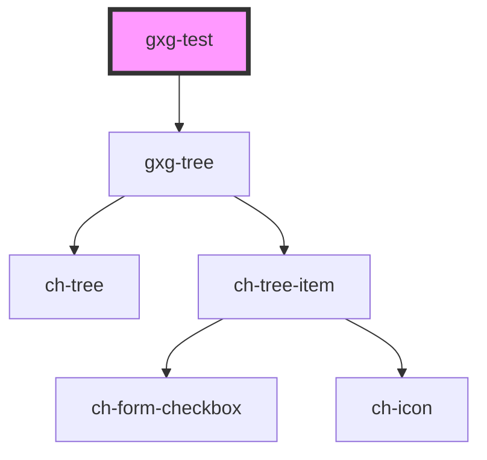

# gxg-test

<!-- Auto Generated Below -->

## Properties

| Property | Attribute | Description | Type  | Default     |
| -------- | --------- | ----------- | ----- | ----------- |
| `model`  | `model`   |             | `any` | `undefined` |

## Dependencies

### Depends on

- [gxg-tree](../tree)

### Graph

---

_Built with [StencilJS](https://stenciljs.com/)_
