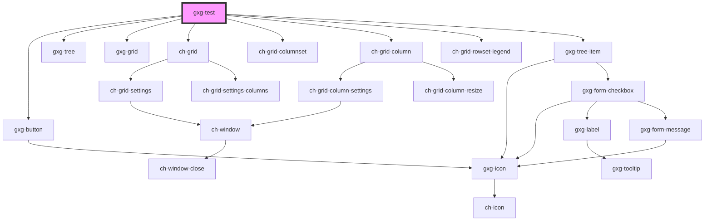

# gxg-test

<!-- Auto Generated Below -->

## Properties

| Property                    | Attribute                  | Description | Type                                                 | Default     |
| --------------------------- | -------------------------- | ----------- | ---------------------------------------------------- | ----------- |
| `buttonTestExportParts`     | `button-test-export-parts` |             | `boolean`                                            | `false`     |
| `lazyLoadTreeItemsCallback` | --                         |             | `(treeItemId: string) => Promise<GxgTreeItemData[]>` | `undefined` |
| `showGrid`                  | `show-grid`                |             | `boolean`                                            | `false`     |
| `showGridData`              | `show-grid-data`           |             | `boolean`                                            | `false`     |
| `treeItemsModel`            | --                         |             | `GxgTreeItemData[]`                                  | `undefined` |

## Shadow Parts

| Part                            | Description |
| ------------------------------- | ----------- |
| `"ch-grid-pending-for-updates"` |             |
| `"exterior-part"`               |             |

## Dependencies

### Depends on

- [gxg-button](../button)
- [gxg-tree](../tree)
- [gxg-grid](../grid)
- ch-grid
- ch-grid-columnset
- ch-grid-column
- ch-grid-rowset-legend
- [gxg-tree-item](../tree-item)

### Graph

---

_Built with [StencilJS](https://stenciljs.com/)_
