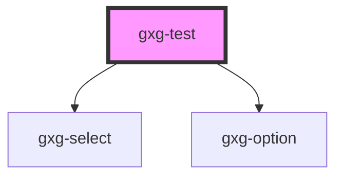

# gxg-test

<!-- Auto Generated Below -->

## Properties

| Property         | Attribute         | Description | Type     | Default |
| ---------------- | ----------------- | ----------- | -------- | ------- |
| `selectedOption` | `selected-option` |             | `string` | `"two"` |

## Dependencies

### Depends on

- [gxg-select](../form-select)
- [gxg-option](../form-option)

### Graph

---

_Built with [StencilJS](https://stenciljs.com/)_
