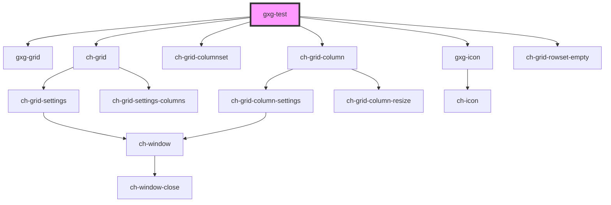

# gxg-test

<!-- Auto Generated Below -->

## Dependencies

### Depends on

- [gxg-grid](../grid)
- ch-grid
- ch-grid-columnset
- ch-grid-column
- [gxg-icon](../icon)
- ch-grid-rowset-empty

### Graph

---

_Built with [StencilJS](https://stenciljs.com/)_
