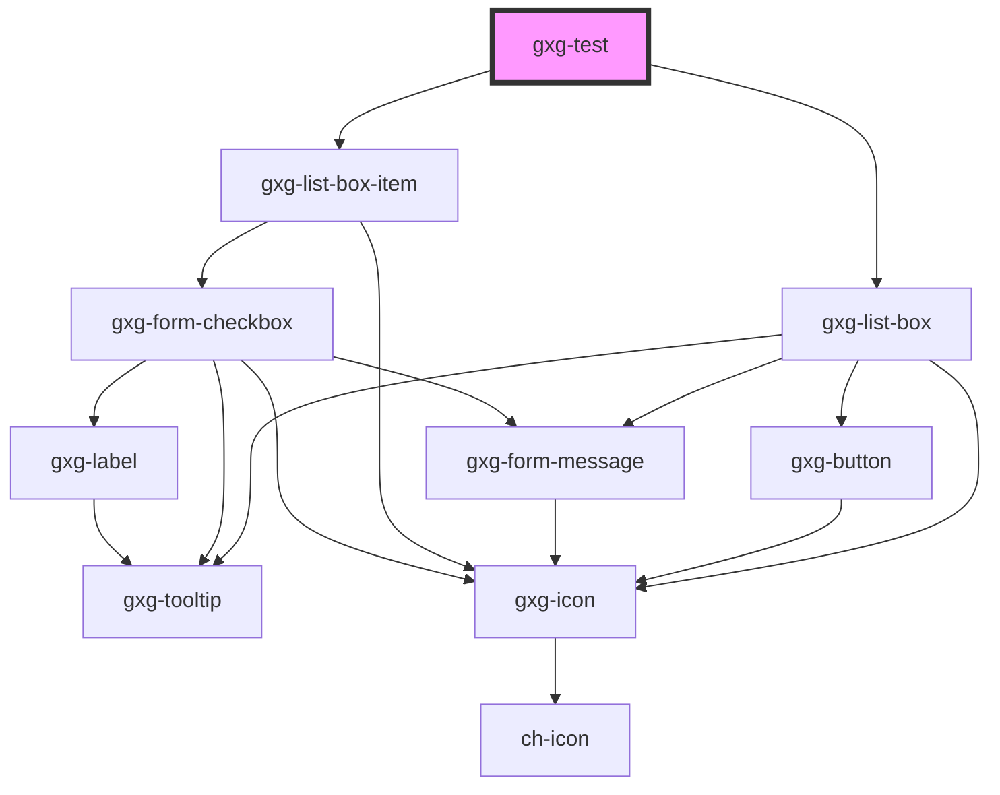

# gxg-test

<!-- Auto Generated Below -->

## Shadow Parts

| Part    | Description |
| ------- | ----------- |
| `"kbs"` |             |

## Dependencies

### Depends on

- [gxg-list-box](../list-box)
- [gxg-list-box-item](../list-box-item)

### Graph

----------------------------------------------

*Built with [StencilJS](https://stenciljs.com/)*
