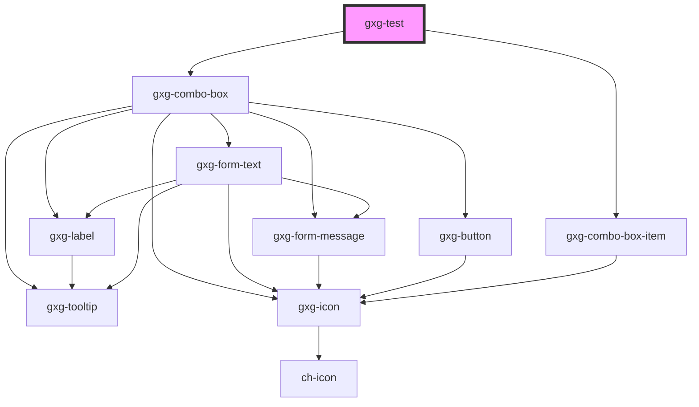

# gxg-test

<!-- Auto Generated Below -->

## Dependencies

### Depends on

- [gxg-combo-box](../combo-box)
- [gxg-combo-box-item](../combo-box-item)

### Graph

---

_Built with [StencilJS](https://stenciljs.com/)_
