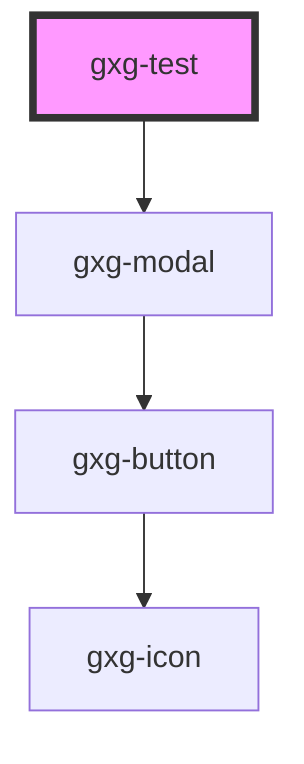

# gxg-test

<!-- Auto Generated Below -->

## Properties

| Property       | Attribute | Description | Type       | Default                     |
| -------------- | --------- | ----------- | ---------- | --------------------------- |
| `optionsArray` | --        |             | `string[]` | `["rojo", "azul", "verde"]` |

## Dependencies

### Depends on

- [gxg-modal](../modal)

### Graph

---

_Built with [StencilJS](https://stenciljs.com/)_
