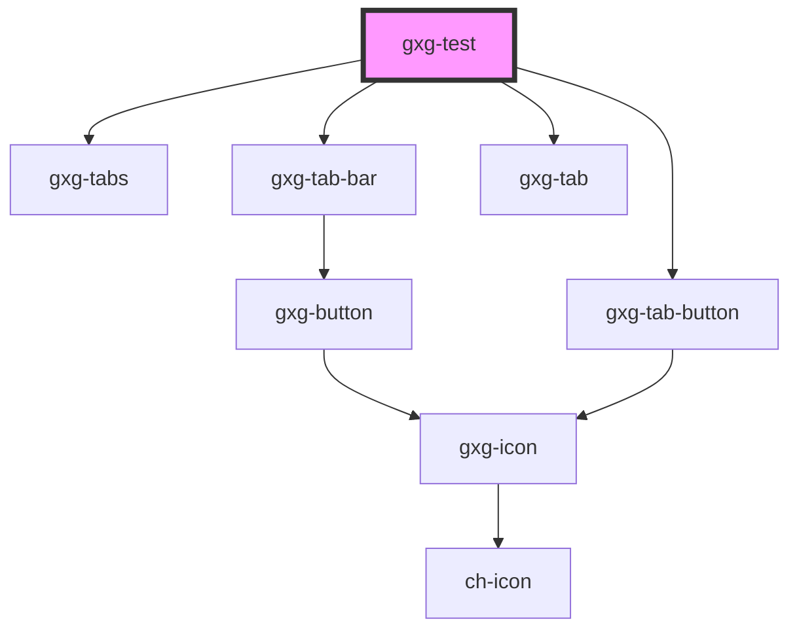

# gxg-test

<!-- Auto Generated Below -->

## Properties

| Property                | Attribute                 | Description | Type      | Default    |
| ----------------------- | ------------------------- | ----------- | --------- | ---------- |
| `name`                  | `name`                    |             | `string`  | `"Andres"` |
| `show`                  | `show`                    |             | `boolean` | `false`    |
| `showValidationMessage` | `show-validation-message` |             | `boolean` | `false`    |

## Dependencies

### Depends on

- [gxg-tabs](../tabs)
- [gxg-tab-bar](../tab-bar)
- [gxg-tab-button](../tab-button)
- [gxg-tab](../tab)

### Graph

---

_Built with [StencilJS](https://stenciljs.com/)_
