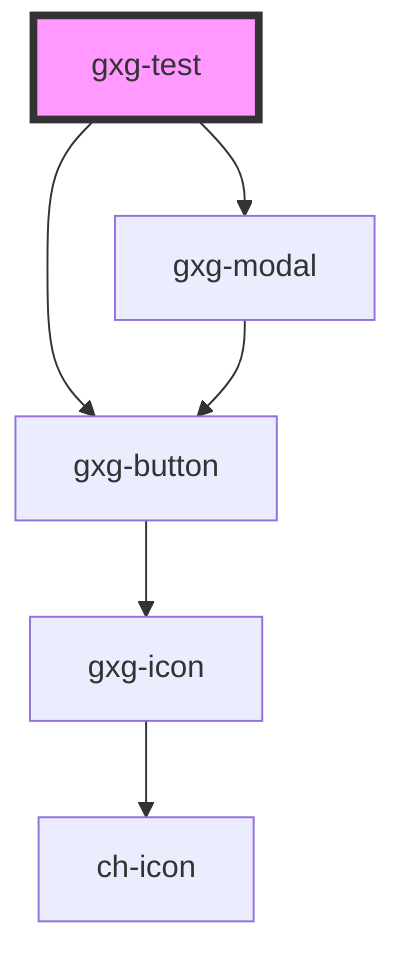

# gxg-test

<!-- Auto Generated Below -->

## Properties

| Property | Attribute | Description | Type      | Default    |
| -------- | --------- | ----------- | --------- | ---------- |
| `name`   | `name`    |             | `string`  | `"Andres"` |
| `show`   | `show`    |             | `boolean` | `false`    |

## Dependencies

### Depends on

- [gxg-modal](../modal)
- [gxg-button](../button)

### Graph

---

_Built with [StencilJS](https://stenciljs.com/)_
