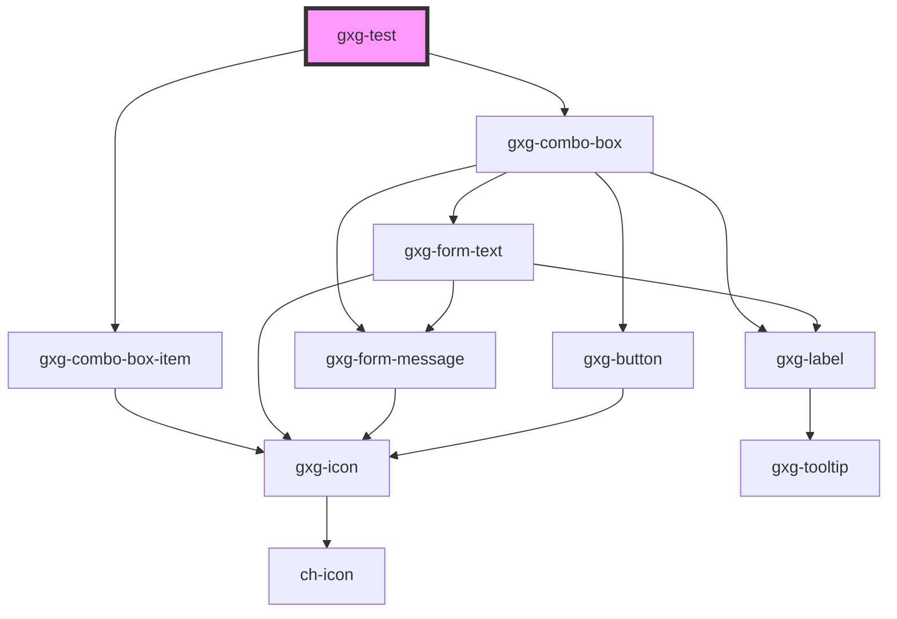

# gxg-test

<!-- Auto Generated Below -->

## Properties

| Property      | Attribute | Description                                             | Type                                                                                                                                                | Default                                                                                                                                                                                                                                                                                                                                                                     |
| ------------- | --------- | ------------------------------------------------------- | --------------------------------------------------------------------------------------------------------------------------------------------------- | --------------------------------------------------------------------------------------------------------------------------------------------------------------------------------------------------------------------------------------------------------------------------------------------------------------------------------------------------------------------------- |
| `comboValues` | --        | The presence of this attribute makes the input disabled | `({ id: string; label: string; iconName: string; selected: boolean; } \| { id: string; label: string; iconName: string; selected?: undefined; })[]` | `[ { id: "web-net", label: "Web (.NET)", iconName: null, }, { id: "android", label: "Android", iconName: "general/android", selected: true, }, { id: "apple", label: "Apple", iconName: "general/apple", }, { id: "web-angular", label: "Web (Angular)", iconName: "general/angular", }, { id: "we-chat-mini-program", label: "We Chat Mini Program", iconName: null, }, ]` |

## Dependencies

### Depends on

- [gxg-combo-box-item](../combo-box-item)
- [gxg-combo-box](../combo-box)

### Graph

---

_Built with [StencilJS](https://stenciljs.com/)_
