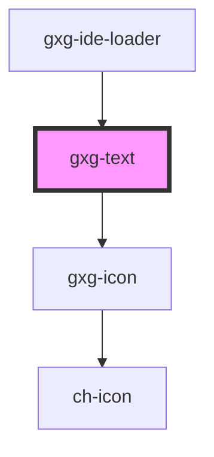

# gxg-text

<!-- Auto Generated Below -->


## Usage

### Usage

```
<gxg-text type="text-regular">Lorem ipsum dolor sit amet, consectetur adipisicing elit. Cumque distinctio illum nostrum, id eum, eveniet odit voluptas sunt fuga perferendis ex porro et dolor, ipsam ducimus! Nulla ut similique maiores.</gxg-text><br>
<gxg-text type="text-gray">Lorem ipsum dolor, sit amet consectetur adipisicing elit. A impedit eligendi ipsa nihil animi quibusdam quis expedita, odit praesentium consequatur laudantium reiciendis magnam, explicabo doloremque perspiciatis, repellendus alias officia quasi.</gxg-text><br>
<gxg-text type="text-quote">Lorem ipsum dolor sit amet consectetur adipisicing elit. Dignissimos nulla aut, id eum saepe recusandae sed natus. Commodi eius laborum voluptates rem voluptas ea hic labore, recusandae consectetur similique minus!</gxg-text><br>
<gxg-text type="text-link">A link</gxg-text><br>
<gxg-text type="text-link-gray">A gray link</gxg-text><br>
<gxg-text type="text-alert-error">An error message</gxg-text><br>
<gxg-text type="text-alert-warning">A warning message</gxg-text><br>
<gxg-text type="text-alert-success">A sucess message</gxg-text>
```


## Properties

| Property    | Attribute    | Description                                 | Type                                                                                                                                                                                                                         | Default          |
| ----------- | ------------ | ------------------------------------------- | ---------------------------------------------------------------------------------------------------------------------------------------------------------------------------------------------------------------------------- | ---------------- |
| `disabled`  | `disabled`   | Disables the interactive types of text      | `boolean`                                                                                                                                                                                                                    | `false`          |
| `href`      | `href`       | The href (for "link" or "link-gray" types   | `string`                                                                                                                                                                                                                     | `undefined`      |
| `icon`      | `icon`       | The gemini icon type                        | `string`                                                                                                                                                                                                                     | `undefined`      |
| `iconAlign` | `icon-align` | The icon alignment on the vertical axis.    | `"center" \| "top"`                                                                                                                                                                                                          | `"center"`       |
| `iconAuto`  | `icon-auto`  | It will force the icon color to be auto     | `boolean`                                                                                                                                                                                                                    | `false`          |
| `italic`    | `italic`     | Italic (only for mercury)                   | `boolean`                                                                                                                                                                                                                    | `false`          |
| `maxWidth`  | `max-width`  | Max. width                                  | `string`                                                                                                                                                                                                                     | `"100%"`         |
| `padding`   | `padding`    | Text padding                                | `"m" \| "none" \| "s"`                                                                                                                                                                                                       | `"none"`         |
| `target`    | `target`     | The target (for "link" or "link-gray" types | `"_blank" \| "_self"`                                                                                                                                                                                                        | `"_self"`        |
| `textAlign` | `text-align` | Text alignment                              | `"center" \| "end" \| "start"`                                                                                                                                                                                               | `"start"`        |
| `type`      | `type`       | Text type                                   | `"button-like" \| "text-alert-error" \| "text-alert-success" \| "text-alert-warning" \| "text-gray" \| "text-link" \| "text-link-gray" \| "text-link-gray-no-line" \| "text-link-no-line" \| "text-quote" \| "text-regular"` | `"text-regular"` |


## Dependencies

### Used by

 - [gxg-ide-loader](../ide-loader)

### Depends on

- [gxg-icon](../icon)

### Graph


----------------------------------------------

*Built with [StencilJS](https://stenciljs.com/)*
