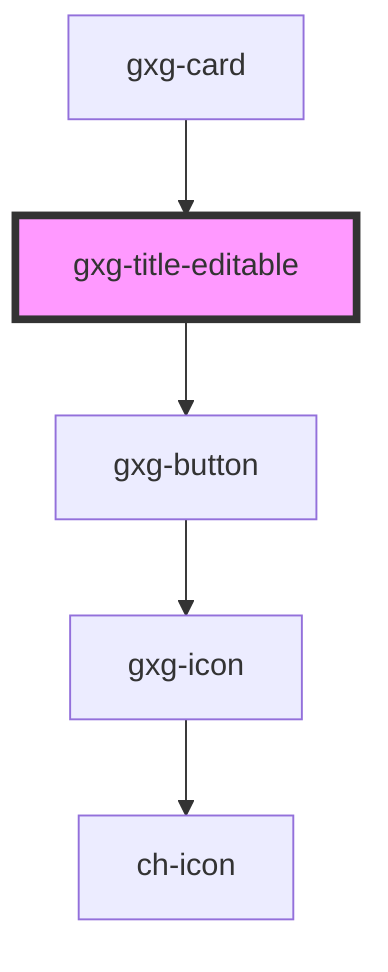

# gxg-title-editable

<!-- Auto Generated Below -->

## Properties

| Property         | Attribute         | Description                                                             | Type                           | Default     |
| ---------------- | ----------------- | ----------------------------------------------------------------------- | ------------------------------ | ----------- |
| `clickToEdit`    | `click-to-edit`   | If true, it will allow the title to be edited                           | `boolean`                      | `false`     |
| `disableEdition` | `disable-edition` | If true, the title will not be editable                                 | `boolean`                      | `false`     |
| `fluid`          | `fluid`           | If true, the width of the title will take only the minimum needed space | `boolean`                      | `false`     |
| `focusType`      | `focus-type`      | If true, the width of the title will take only the minimum needed space | `"line" \| "text"`             | `undefined` |
| `titleType`      | `title-type`      | The title type                                                          | `"h1" \| "h2" \| "h3" \| "h4"` | `"h1"`      |
| `value`          | `value`           | The title value                                                         | `string`                       | `undefined` |

## Dependencies

### Used by

- [gxg-card](../card)

### Depends on

- [gxg-button](../button)

### Graph

---

_Built with [StencilJS](https://stenciljs.com/)_
