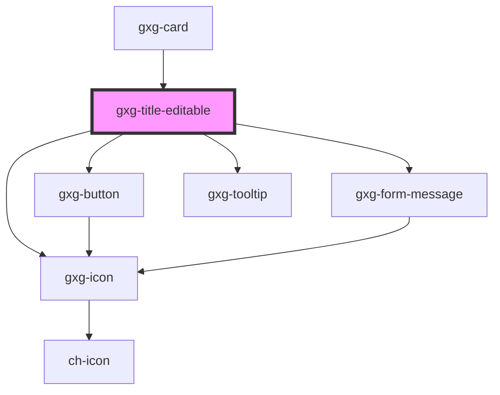

# gxg-title-editable

<!-- Auto Generated Below -->

## Properties

| Property            | Attribute            | Description                                                                                                                                         | Type                                                   | Default           |
| ------------------- | -------------------- | --------------------------------------------------------------------------------------------------------------------------------------------------- | ------------------------------------------------------ | ----------------- |
| `clickToEdit`       | `click-to-edit`      | If true, it will allow the title to be edited                                                                                                       | `boolean`                                              | `false`           |
| `debounce`          | `debounce`           | The presence of this attribute activates a debounce for the valueChanged event. This will cause the event to be emitted after 'debounceDelay' time. | `boolean`                                              | `false`           |
| `debounceDelay`     | `debounce-delay`     | The debounce delay value. Only applies if 'debounce' is true.                                                                                       | `number`                                               | `800`             |
| `disableEdition`    | `disable-edition`    | If true, the title will not be editable                                                                                                             | `boolean`                                              | `false`           |
| `disabled`          | `disabled`           | The presence of this attribute makes the input disabled                                                                                             | `boolean`                                              | `false`           |
| `fluid`             | `fluid`              | If true, the width of the title will take only the minimum needed space                                                                             | `boolean`                                              | `false`           |
| `focusType`         | `focus-type`         | If true, the width of the title will take only the minimum needed space                                                                             | `"line" \| "text"`                                     | `undefined`       |
| `hideTooltip`       | `hide-tooltip`       | Shows or hides the tooltip                                                                                                                          | `boolean`                                              | `false`           |
| `titleType`         | `title-type`         | The title type                                                                                                                                      | `"h1" \| "h2" \| "h3" \| "h4"`                         | `"h1"`            |
| `validationMessage` | `validation-message` | The message to display when validation fails (error)                                                                                                | `string`                                               | `undefined`       |
| `validationStatus`  | `validation-status`  | The validation status                                                                                                                               | `"error" \| "indeterminate" \| "success" \| "warning"` | `"indeterminate"` |
| `value`             | `value`              | The title value                                                                                                                                     | `string`                                               | `undefined`       |

## Events

| Event          | Description                    | Type                  |
| -------------- | ------------------------------ | --------------------- |
| `valueChanged` | Emitted when the value changes | `CustomEvent<string>` |

## Dependencies

### Used by

- [gxg-card](../card)

### Depends on

- [gxg-button](../button)
- [gxg-form-message](../form-message)
- [gxg-tooltip](../tooltip)
- [gxg-icon](../icon)

### Graph

---

_Built with [StencilJS](https://stenciljs.com/)_
