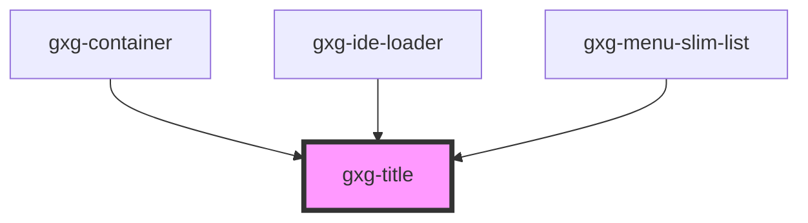

# gxg-title

<!-- Auto Generated Below -->


## Usage

### Usage

```
<gxg-title type="title-01">This is a title type 01</gxg-title><br>
<gxg-title type="title-02">This is a title type 02</gxg-title><br>
<gxg-title type="title-03">This is a title type 03</gxg-title><br>
<gxg-title type="title-04">This is a title type 04</gxg-title><br>
<gxg-title type="title-05">This is a title type 05</gxg-title>
```


## Properties

| Property    | Attribute   | Description | Type                                                                 | Default      |
| ----------- | ----------- | ----------- | -------------------------------------------------------------------- | ------------ |
| `alignment` | `alignment` | Title type  | `"center" \| "end" \| "start"`                                       | `"start"`    |
| `type`      | `type`      | Title type  | `"title-01" \| "title-02" \| "title-03" \| "title-04" \| "title-05"` | `"title-01"` |


## Shadow Parts

| Part      | Description |
| --------- | ----------- |
| `"title"` |             |


## Dependencies

### Used by

 - [gxg-container](../container)
 - [gxg-ide-loader](../ide-loader)
 - [gxg-menu-slim-list](../menu-slim/list)

### Graph


----------------------------------------------

*Built with [StencilJS](https://stenciljs.com/)*
