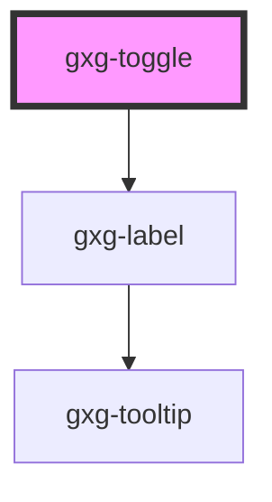

# gxg-toggle

<!-- Auto Generated Below -->

## Properties

| Property   | Attribute  | Description                                          | Type      | Default     |
| ---------- | ---------- | ---------------------------------------------------- | --------- | ----------- |
| `disabled` | `disabled` | The state of the toggle. Whether is disabled or not. | `boolean` | `false`     |
| `label`    | `label`    | The label                                            | `string`  | `undefined` |
| `on`       | `on`       | If the toggle is active or not                       | `boolean` | `false`     |

## Events

| Event            | Description                                                                                                                                   | Type               |
| ---------------- | --------------------------------------------------------------------------------------------------------------------------------------------- | ------------------ |
| `toggleSwitched` | This event is triggered when the toggle is switched. 'event.detail' will display true when the toggle is on, or false when the toggle is off. | `CustomEvent<any>` |

## Dependencies

### Depends on

- [gxg-label](../label)

### Graph

---

_Built with [StencilJS](https://stenciljs.com/)_
