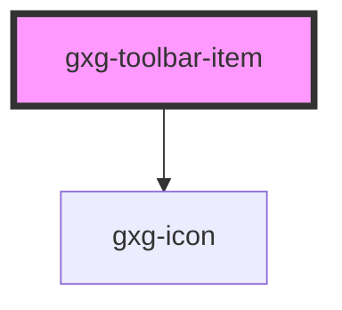

# gxg-toolbar-item

<!-- Auto Generated Below -->

## Properties

| Property           | Attribute            | Description                                                  | Type      | Default     |
| ------------------ | -------------------- | ------------------------------------------------------------ | --------- | ----------- |
| `disabled`         | `disabled`           | The state of the toolbar-item, whether it is disabled or not | `boolean` | `false`     |
| `icon`             | `icon`               | The toolbar-item icon                                        | `string`  | `null`      |
| `subtitle`         | `subtitle`           | The toolbar-item subtitle                                    | `string`  | `undefined` |
| `toolbarItemTitle` | `toolbar-item-title` | The toolbar-item title                                       | `string`  | `undefined` |

## Dependencies

### Depends on

- [gxg-icon](../icon)

### Graph

---

_Built with [StencilJS](https://stenciljs.com/)_
