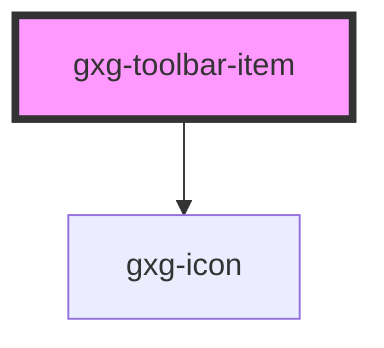

# gxg-template

<!-- Auto Generated Below -->

## Properties

| Property   | Attribute  | Description | Type                                                                                                                                                                                                                                                                                                                                                                                      | Default     |
| ---------- | ---------- | ----------- | ----------------------------------------------------------------------------------------------------------------------------------------------------------------------------------------------------------------------------------------------------------------------------------------------------------------------------------------------------------------------------------------- | ----------- |
| `disabled` | `disabled` |             | `boolean`                                                                                                                                                                                                                                                                                                                                                                                 | `false`     |
| `icon`     | `icon`     |             | `"more-info" \| "error" \| "warning" \| "success" \| "none" \| "add" \| "arrow-down" \| "arrow-left" \| "arrow-right" \| "arrow-up" \| "chevron-down" \| "chevron-left" \| "chevron-right" \| "chevron-up" \| "close" \| "color-picker" \| "deleted" \| "drag" \| "duplicate" \| "edit-wand" \| "edit" \| "empty" \| "level-down" \| "level-up" \| "search" \| "settings" \| "show-more"` | `null`      |
| `subtitle` | `subtitle` |             | `string`                                                                                                                                                                                                                                                                                                                                                                                  | `undefined` |
| `title`    | `title`    |             | `string`                                                                                                                                                                                                                                                                                                                                                                                  | `undefined` |

## Dependencies

### Depends on

- [gxg-icon](../icon)

### Graph

---

_Built with [StencilJS](https://stenciljs.com/)_
