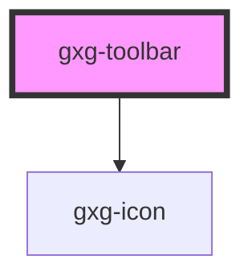

# gxg-toolbar-item

## Properties

| Property           | Attribute            | Description                                                  | Type                                                                                                                                                                                                                                                                                                                                                                                                                                                                                                       | Default     |
| ------------------ | -------------------- | ------------------------------------------------------------ | ---------------------------------------------------------------------------------------------------------------------------------------------------------------------------------------------------------------------------------------------------------------------------------------------------------------------------------------------------------------------------------------------------------------------------------------------------------------------------------------------------------- | ----------- |
| `disabled`         | `disabled`           | The state of the toolbar-item, whether it is disabled or not | `boolean`                                                                                                                                                                                                                                                                                                                                                                                                                                                                                                  | `false`     |
| `icon`             | `icon`               | The toolbar-item icon                                        | `"error" \| "success" \| "warning" \| "none" \| "add" \| "add-circle" \| "arrow-down" \| "arrow-left" \| "arrow-right" \| "arrow-up" \| "chevron-down" \| "chevron-left" \| "chevron-right" \| "chevron-up" \| "close" \| "color-picker" \| "deleted" \| "drag" \| "duplicate" \| "edit-wand" \| "edit" \| "empty" \| "file" \| "folder" \| "level-down" \| "level-up" \| "minus" \| "minus-circle" \| "more-info" \| "reset" \| "search" \| "settings" \| "show-more-horizontal" \| "show-more-vertical"` | `null`      |
| `subtitle`         | `subtitle`           | The toolbar-item subtitle                                    | `string`                                                                                                                                                                                                                                                                                                                                                                                                                                                                                                   | `undefined` |
| `toolbarItemTitle` | `toolbar-item-title` | The toolbar-item title                                       | `string`                                                                                                                                                                                                                                                                                                                                                                                                                                                                                                   | `undefined` |

# gxg-toolbar

<h2>Implementing a gxg-toolbar</h2>
<ol>
  <li>Insert a <code>gxg-toolbar</code> element</li>
   <li>Inside the <code>gxg-toolbar</code> insert as many <code>gxg-toolbar-item</code>'s as desired</li>
   <li>For each <code>gxg-toolbar-item</code> item provide the following attributes/values: <code>icon</code>, <code>title</code>, <code>subtitle</code></li>
</ol>

<!-- Auto Generated Below -->

## Properties

| Property       | Attribute       | Description                                        | Type      | Default     |
| -------------- | --------------- | -------------------------------------------------- | --------- | ----------- |
| `disabled`     | `disabled`      | The state of the toggle, wether is disabled or not | `boolean` | `false`     |
| `position`     | `position`      | The toggle arrow position                          | `string`  | `"bottom"`  |
| `subtitle`     | `subtitle`      | The toolbar title                                  | `string`  | `undefined` |
| `toolbarTitle` | `toolbar-title` | The toolbar subtitle                               | `string`  | `undefined` |

## Dependencies

### Depends on

- [gxg-icon](../icon)

### Graph

---

_Built with [StencilJS](https://stenciljs.com/)_
