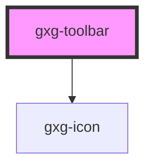

# gxg-template

<!-- Auto Generated Below -->

## Properties

| Property   | Attribute  | Description | Type      | Default     |
| ---------- | ---------- | ----------- | --------- | ----------- |
| `disabled` | `disabled` |             | `boolean` | `false`     |
| `position` | `position` |             | `string`  | `"bottom"`  |
| `subtitle` | `subtitle` |             | `string`  | `undefined` |
| `title`    | `title`    |             | `string`  | `undefined` |

## Dependencies

### Depends on

- [gxg-icon](../icon)

### Graph

---

_Built with [StencilJS](https://stenciljs.com/)_
