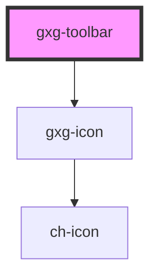

# gxg-toolbar-item

## Properties

| Property           | Attribute            | Description                                                  | Type      | Default     |
| ------------------ | -------------------- | ------------------------------------------------------------ | --------- | ----------- |
| `disabled`         | `disabled`           | The state of the toolbar-item, whether it is disabled or not | `boolean` | `false`     |
| `icon`             | `icon`               | The toolbar-item icon                                        | `string`  | `null`      |
| `subtitle`         | `subtitle`           | The toolbar-item subtitle                                    | `string`  | `undefined` |
| `toolbarItemTitle` | `toolbar-item-title` | The toolbar-item title                                       | `string`  | `undefined` |

# gxg-toolbar

<h2>Implementing a gxg-toolbar</h2>
<ol>
  <li>Insert a <code>gxg-toolbar</code> element.</li>
   <li>Inside the <code>gxg-toolbar</code> insert as many <code>gxg-toolbar-item</code>'s as desired.</li>
   <li>For each <code>gxg-toolbar-item</code> item provide the following attributes/values: <code>icon</code>, <code>toolbar-item-title</code>, <code>subtitle</code>.</li>
   <li>Provide a <code>toolbar-title</code> and a <code>subtitle</code> to the <code>gxg-toolbar</code> as well.</li>
</ol>

<!-- Auto Generated Below -->

## Properties

| Property       | Attribute       | Description               | Type                           | Default     |
| -------------- | --------------- | ------------------------- | ------------------------------ | ----------- |
| `position`     | `position`      | The toggle arrow position | `"bottom" \| "start" \| "top"` | `"bottom"`  |
| `subtitle`     | `subtitle`      | The toolbar title         | `string`                       | `undefined` |
| `toolbarTitle` | `toolbar-title` | The toolbar subtitle      | `string`                       | `undefined` |

## Dependencies

### Depends on

- [gxg-icon](../icon)

### Graph

---

_Built with [StencilJS](https://stenciljs.com/)_
