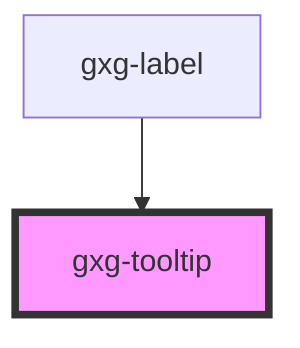

# gxg-tooltip

<!-- Auto Generated Below -->

## Properties

| Property   | Attribute   | Description                                                      | Type                                     | Default     |
| ---------- | ----------- | ---------------------------------------------------------------- | ---------------------------------------- | ----------- |
| `label`    | `label`     | The label                                                        | `string`                                 | `undefined` |
| `noBorder` | `no-border` | This presence of this property removes the border under the text | `boolean`                                | `false`     |
| `position` | `position`  | the tooltip position                                             | `"bottom" \| "left" \| "right" \| "top"` | `"top"`     |

## Dependencies

### Used by

- [gxg-label](../label)

### Graph

---

_Built with [StencilJS](https://stenciljs.com/)_
