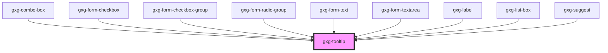

# gxg-tooltip

<!-- Auto Generated Below -->

## Properties

| Property   | Attribute   | Description                                                      | Type                                     | Default     |
| ---------- | ----------- | ---------------------------------------------------------------- | ---------------------------------------- | ----------- |
| `alignEnd` | `align-end` | The alignment                                                    | `boolean`                                | `false`     |
| `fixed`    | `fixed`     | Fixed positioned                                                 | `boolean`                                | `false`     |
| `flex`     | `flex`      | Displays the tool-tip as flex                                    | `boolean`                                | `false`     |
| `label`    | `label`     | The label                                                        | `string`                                 | `undefined` |
| `noBorder` | `no-border` | This presence of this property removes the border under the text | `boolean`                                | `false`     |
| `position` | `position`  | the tooltip position                                             | `"bottom" \| "left" \| "right" \| "top"` | `"top"`     |

## Dependencies

### Used by

 - [gxg-combo-box](../combo-box)
 - [gxg-form-checkbox](../form-checkbox)
 - [gxg-form-checkbox-group](../form-checkbox-group)
 - [gxg-form-radio-group](../form-radio-group)
 - [gxg-form-text](../form-text)
 - [gxg-form-textarea](../form-textarea)
 - [gxg-label](../label)
 - [gxg-list-box](../list-box)
 - [gxg-suggest](../suggest)

### Graph

----------------------------------------------

*Built with [StencilJS](https://stenciljs.com/)*
