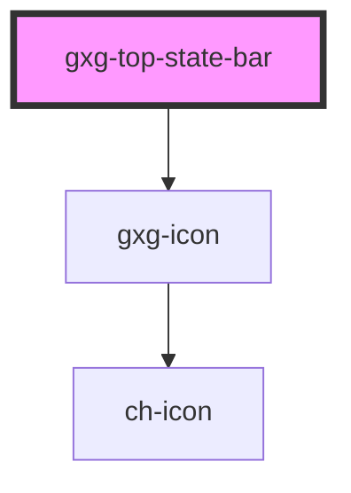

# gxg-top-state-bar

<!-- Auto Generated Below -->

## Properties

| Property          | Attribute           | Description                                          | Type                                                             | Default         |
| ----------------- | ------------------- | ---------------------------------------------------- | ---------------------------------------------------------------- | --------------- |
| `active`          | `active`            | The top-bar active state. If false it will be hidden | `boolean`                                                        | `false`         |
| `autoClose`       | `auto-close`        | It true, it will auto-close when the progress is 100 | `boolean`                                                        | `false`         |
| `caption`         | `caption`           | The top-bar title                                    | `string`                                                         | `undefined`     |
| `progress`        | `progress`          | The progress bar progress                            | `number`                                                         | `0`             |
| `stateType`       | `state-type`        | The top-bar title                                    | `"accent" \| "error" \| "in-progress" \| "success" \| "warning"` | `"in-progress"` |
| `withProgressBar` | `with-progress-bar` | It will display a progress bar                       | `boolean`                                                        | `false`         |

## Shadow Parts

| Part        | Description |
| ----------- | ----------- |
| `"label"`   |             |
| `"wrapper"` |             |

## Dependencies

### Depends on

- [gxg-icon](../icon)

### Graph

----------------------------------------------

*Built with [StencilJS](https://stenciljs.com/)*
