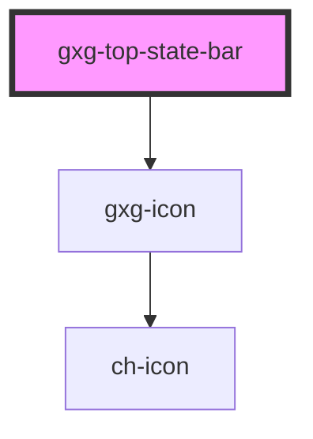

# gxg-top-state-bar

<!-- Auto Generated Below -->

## Properties

| Property         | Attribute         | Description                                                  | Type                                                             | Default         |
| ---------------- | ----------------- | ------------------------------------------------------------ | ---------------------------------------------------------------- | --------------- |
| `active`         | `active`          | The top-bar active state. If false it will be hidden         | `boolean`                                                        | `false`         |
| `autoClose`      | `auto-close`      | It true, it will auto-close when the progress is 100         | `boolean`                                                        | `false`         |
| `caption`        | `caption`         | The top-bar title                                            | `string`                                                         | `undefined`     |
| `closedCallback` | `closed-callback` | A callback that gets called when the top-state-bar is closed | `boolean`                                                        | `false`         |
| `noBorder`       | `no-border`       | It removes the border (actually is box shadow)               | `boolean`                                                        | `false`         |
| `progress`       | `progress`        | The progress bar progress                                    | `number`                                                         | `undefined`     |
| `stateType`      | `state-type`      | The top-bar title                                            | `"accent" \| "error" \| "in-progress" \| "success" \| "warning"` | `"in-progress"` |
| `withClose`      | `with-close`      | It will display a close action button                        | `boolean`                                                        | `undefined`     |

## Shadow Parts

| Part                 | Description |
| -------------------- | ----------- |
| `"label"`            |             |
| `"progress-wrapper"` |             |

## Dependencies

### Depends on

- [gxg-icon](../icon)

### Graph

----------------------------------------------

*Built with [StencilJS](https://stenciljs.com/)*
