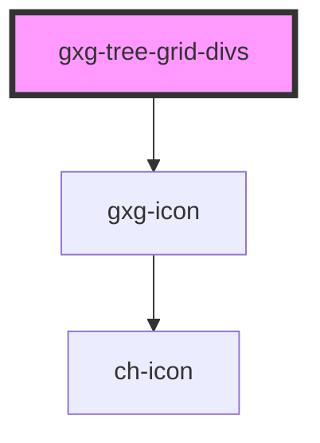

# gxg-tree-grid

<!-- Auto Generated Below -->

## Properties

| Property          | Attribute           | Description | Type                                     | Default     |
| ----------------- | ------------------- | ----------- | ---------------------------------------- | ----------- |
| `columns`         | --                  |             | `object[]`                               | `undefined` |
| `displayChildren` | `display-children`  |             | `"all" \| "none"`                        | `"all"`     |
| `editCell`        | --                  |             | `{ rowId: number; columnName: string; }` | `undefined` |
| `rows`            | --                  |             | `object[]`                               | `undefined` |
| `selectedRowsIds` | `selected-rows-ids` |             | `number`                                 | `undefined` |
| `width`           | `width`             |             | `string`                                 | `"100%"`    |

## Events

| Event          | Description | Type               |
| -------------- | ----------- | ------------------ |
| `addRow`       |             | `CustomEvent<any>` |
| `removeRow`    |             | `CustomEvent<any>` |
| `selectedRows` |             | `CustomEvent<any>` |

## Dependencies

### Depends on

- [gxg-icon](../icon)

### Graph

----------------------------------------------

*Built with [StencilJS](https://stenciljs.com/)*
