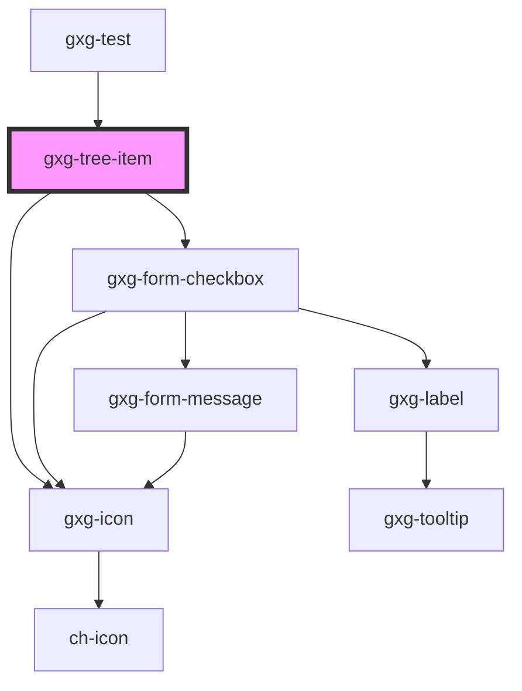

# gxgch-tree-item

<!-- Auto Generated Below -->

## Properties

| Property           | Attribute           | Description                                                                                                                                                                                                                       | Type                 | Default     |
| ------------------ | ------------------- | --------------------------------------------------------------------------------------------------------------------------------------------------------------------------------------------------------------------------------- | -------------------- | ----------- |
| `checkbox`         | `checkbox`          | Set this attribute if you want this item to display a checkbox. This attribute is affected by the parent tree-item checkbox attribute, unless it is set in this item.                                                             | `boolean`            | `undefined` |
| `checked`          | `checked`           | Set this attribute if you want this item to be checked by default. This attribute is affected by the parent tree-item checked attribute, unless it is set in this item.                                                           | `boolean`            | `undefined` |
| `disabled`         | `disabled`          | The presence of this attribute makes this tree item disabled. This attribute is affected by the parent tree type attribute, unless it is set in this item.                                                                        | `boolean`            | `undefined` |
| `firstTreeItem`    | `first-tree-item`   |                                                                                                                                                                                                                                   | `boolean`            | `false`     |
| `hasChildTree`     | `has-child-tree`    |                                                                                                                                                                                                                                   | `boolean`            | `false`     |
| `icon`             | `icon`              | Sets the tree item icon                                                                                                                                                                                                           | `string`             | `undefined` |
| `indeterminate`    | `indeterminate`     |                                                                                                                                                                                                                                   | `boolean`            | `undefined` |
| `isLeaf`           | `is-leaf`           | The presence of this attribute indicates that this tree-item is a leaf, meaning it has no children items. If is not a leaf, it will display a +/- icon to toggle/ontoggle the children tree                                       | `boolean`            | `true`      |
| `label`            | `label`             | The tree item label.                                                                                                                                                                                                              | `string`             | `undefined` |
| `opened`           | `opened`            | Set this attribute if you want this items child tree to be opened by default. This attribute is affected by the parent tree-item opened attribute, unless it is set in this item.                                                 | `boolean`            | `undefined` |
| `selected`         | `selected`          | The presence of this attribute sets the tree-item as selected                                                                                                                                                                     | `boolean`            | `false`     |
| `toggleCheckboxes` | `toggle-checkboxes` | Set this attribute if you want all the children item's checkboxes to be toggled when this item checkbox is toggled. This attribute is affected by the parent tree-item toggleCheckboxes attribute, unless it is set in this item. | `boolean`            | `undefined` |
| `treeModel`        | --                  | This property is for passing a tree structure from the tree.                                                                                                                                                                      | `HTMLGxgTreeElement` | `undefined` |
| `type`             | `type`              | This is the tree-item type/category. This attribute is affected by the parent tree type attribute, unless it is set in this item.                                                                                                 | `string`             | `undefined` |

## Events

| Event               | Description                                                                                                                                                                 | Type                                                                |
| ------------------- | --------------------------------------------------------------------------------------------------------------------------------------------------------------------------- | ------------------------------------------------------------------- |
| `checkboxClicked`   | Emits the checkbox information (chTreeItemData) that includes: the id, name(innerText) and checkbox value.                                                                  | `CustomEvent<{ id: string; checked: boolean; selected: boolean; }>` |
| `liItemClicked`     |                                                                                                                                                                             | `CustomEvent<any>`                                                  |
| `toggleIconClicked` |                                                                                                                                                                             | `CustomEvent<any>`                                                  |
| `treeItemLoaded`    | This events emits the id when it has been loaded. It is useful for the parent tree-items to update, in order to display a toggler icon, or update the vertical line height. | `CustomEvent<string>`                                               |

## Methods

### `updateTreeVerticalLineHeight() => Promise<void>`

#### Returns

Type: `Promise<void>`

### `visibleDescendantsNumber() => Promise<number>`

#### Returns

Type: `Promise<number>`

## Dependencies

### Used by

- [gxg-test](../test)

### Depends on

- [gxg-icon](../icon)
- [gxg-form-checkbox](../form-checkbox)

### Graph

---

_Built with [StencilJS](https://stenciljs.com/)_
