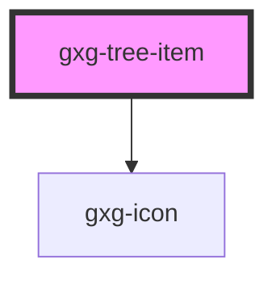

# gxg-tree-item

<h2>Using a gxg-tree</h2>
<ol>
    <li>Insert a <code>gxg-tree</code>element with <code>slot="tree"</code></li>
    <li>
        Add inside the <code>gxg-tree-element</code>, as many <code>gxg-tree-item</code>'s as you need.
    </li>
    <li>
        You can nest as many <code>gxg-tree</code>'s ass you need inside any <code>gxg-tree-item</code>
    </li>
</ol>

<!-- Auto Generated Below -->

## Properties

| Property   | Attribute  | Description                                              | Type                                                                                                                                                                                                                                                                                                                                                                                                                                                                                                       | Default  |
| ---------- | ---------- | -------------------------------------------------------- | ---------------------------------------------------------------------------------------------------------------------------------------------------------------------------------------------------------------------------------------------------------------------------------------------------------------------------------------------------------------------------------------------------------------------------------------------------------------------------------------------------------- | -------- |
| `disabled` | `disabled` | The state of the tree-item, wether it is disabled or not | `boolean`                                                                                                                                                                                                                                                                                                                                                                                                                                                                                                  | `false`  |
| `icon`     | `icon`     | The tree item icon                                       | `"error" \| "success" \| "warning" \| "none" \| "add" \| "add-circle" \| "arrow-down" \| "arrow-left" \| "arrow-right" \| "arrow-up" \| "chevron-down" \| "chevron-left" \| "chevron-right" \| "chevron-up" \| "close" \| "color-picker" \| "deleted" \| "drag" \| "duplicate" \| "edit-wand" \| "edit" \| "empty" \| "file" \| "folder" \| "level-down" \| "level-up" \| "minus" \| "minus-circle" \| "more-info" \| "reset" \| "search" \| "settings" \| "show-more-horizontal" \| "show-more-vertical"` | `"file"` |

## Events

| Event         | Description                      | Type               |
| ------------- | -------------------------------- | ------------------ |
| `itemClicked` | (This event is for internal use) | `CustomEvent<any>` |

## Dependencies

### Depends on

- [gxg-icon](../icon)

### Graph

---

_Built with [StencilJS](https://stenciljs.com/)_
