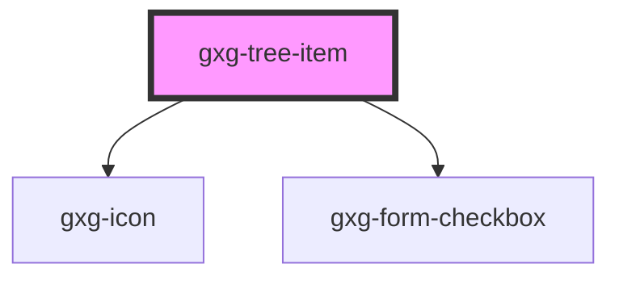

# gxg-test

<!-- Auto Generated Below -->

## Properties

| Property        | Attribute         | Description                                                                                                                    | Type      | Default     |
| --------------- | ----------------- | ------------------------------------------------------------------------------------------------------------------------------ | --------- | ----------- |
| `checkbox`      | `checkbox`        | Set this attribute if you want the gxg-treeitem to display a checkbox                                                          | `boolean` | `false`     |
| `checked`       | `checked`         | Set this attribute if you want the gxg-treeitem checkbox to be checked by default                                              | `boolean` | `false`     |
| `disabled`      | `disabled`        |                                                                                                                                | `boolean` | `false`     |
| `download`      | `download`        | Set this attribute if this tree-item has a resource to be downloaded;                                                          | `boolean` | `false`     |
| `downloading`   | `downloading`     | Set this attribute when you are downloading a resource                                                                         | `boolean` | `false`     |
| `firstTreeItem` | `first-tree-item` |                                                                                                                                | `boolean` | `false`     |
| `hasChildTree`  | `has-child-tree`  |                                                                                                                                | `boolean` | `false`     |
| `indeterminate` | `indeterminate`   |                                                                                                                                | `boolean` | `undefined` |
| `isLeaf`        | `is-leaf`         | The presence of this attribute displays a +/- icon to toggle/untoggle the tree                                                 | `boolean` | `undefined` |
| `leftIcon`      | `left-icon`       | Set the left side icon from the available Gemini icon set : https://gx-gemini.netlify.app/?path=/story/icons-icons--controls   | `string`  | `undefined` |
| `opened`        | `opened`          | If this tree-item has a nested tree, set this attribute to make the tree open by default                                       | `boolean` | `false`     |
| `rightIcon`     | `right-icon`      | Set thhe right side icon from the available Gemini icon set : https://gx-gemini.netlify.app/?path=/story/icons-icons--controls | `string`  | `undefined` |

## Events

| Event           | Description | Type               |
| --------------- | ----------- | ------------------ |
| `liItemClicked` |             | `CustomEvent<any>` |

## Methods

### `myMethod() => Promise<void>`

#### Returns

Type: `Promise<void>`

## Dependencies

### Depends on

- [gxg-icon](../icon)
- [gxg-form-checkbox](../form-checkbox)

### Graph

---

_Built with [StencilJS](https://stenciljs.com/)_
