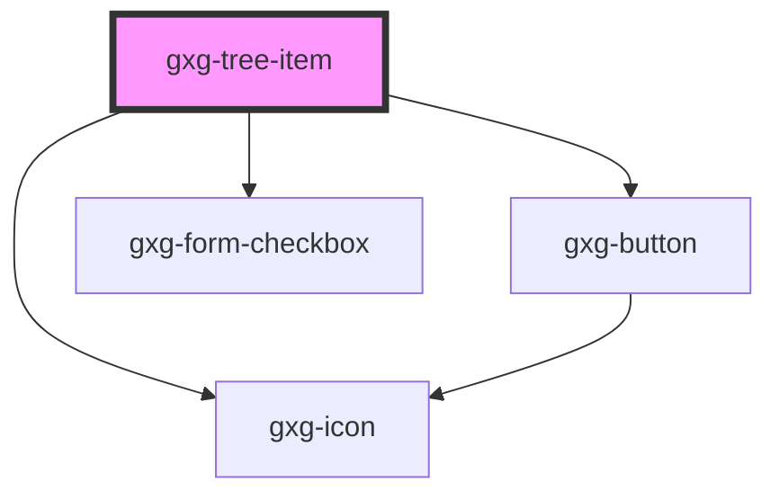

# gxg-test

<!-- Auto Generated Below -->

## Properties

| Property      | Attribute     | Description                                                                                                                          | Type      | Default     |
| ------------- | ------------- | ------------------------------------------------------------------------------------------------------------------------------------ | --------- | ----------- |
| `checkbox`    | `checkbox`    | Set this attribute if you want the gxg-treeitem to display a checkbox                                                                | `boolean` | `false`     |
| `checked`     | `checked`     | Set this attribute if you want the gxg-treeitem checkbox to be checked by default                                                    | `boolean` | `false`     |
| `downloading` | `downloading` | Set this attribute when you are downloading a resource                                                                               | `boolean` | `false`     |
| `focused`     | `focused`     | The presence of this attribute sets focus on it                                                                                      | `boolean` | `false`     |
| `isLeaf`      | `is-leaf`     | The presence of this attribute displays a +/- icon to toggle/untoggle the tree                                                       | `boolean` | `undefined` |
| `leftIcon`    | `left-icon`   | Set thhe left side icon from the available Gemini icon set : https://gx-gemini.netlify.app/?path=/story/icons-icons--controls        | `string`  | `undefined` |
| `opened`      | `opened`      | /\*\* If this tree-item has a nested tree, set this attribute to make the tree open by default                                       | `boolean` | `false`     |
| `rightIcon`   | `right-icon`  | /\*\* Set thhe right side icon from the available Gemini icon set : https://gx-gemini.netlify.app/?path=/story/icons-icons--controls | `string`  | `undefined` |

## Events

| Event           | Description | Type               |
| --------------- | ----------- | ------------------ |
| `liItemClicked` |             | `CustomEvent<any>` |

## Dependencies

### Depends on

- [gxg-button](../button)
- [gxg-form-checkbox](../form-checkbox)
- [gxg-icon](../icon)

### Graph

---

_Built with [StencilJS](https://stenciljs.com/)_
