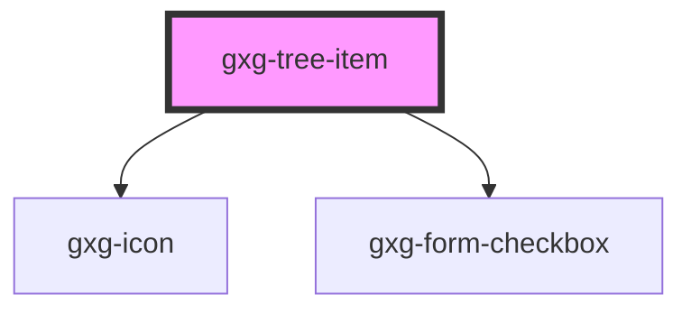

# gxg-test

<!-- Auto Generated Below -->

## Properties

| Property    | Attribute    | Description                                                                              | Type      | Default |
| ----------- | ------------ | ---------------------------------------------------------------------------------------- | --------- | ------- |
| `checkbox`  | `checkbox`   | Set this attribute if you want the gxg-treeitem to display a checkbox                    | `boolean` | `false` |
| `checked`   | `checked`    | Set this attribute if you want the gxg-treeitem checkbox to be checked by default        | `boolean` | `false` |
| `emptyTree` | `empty-tree` | Set this attribute if the tree item has a potential tree to be downloaded                | `boolean` | `false` |
| `isLeaf`    | `is-leaf`    |                                                                                          | `boolean` | `false` |
| `treeOpen`  | `tree-open`  | If this tree-item has a nested tree, set this attribute to make the tree open by default | `boolean` | `false` |

## Events

| Event         | Description | Type               |
| ------------- | ----------- | ------------------ |
| `itemToggled` |             | `CustomEvent<any>` |

## Dependencies

### Depends on

- [gxg-icon](../icon)
- [gxg-form-checkbox](../form-checkbox)

### Graph

---

_Built with [StencilJS](https://stenciljs.com/)_
