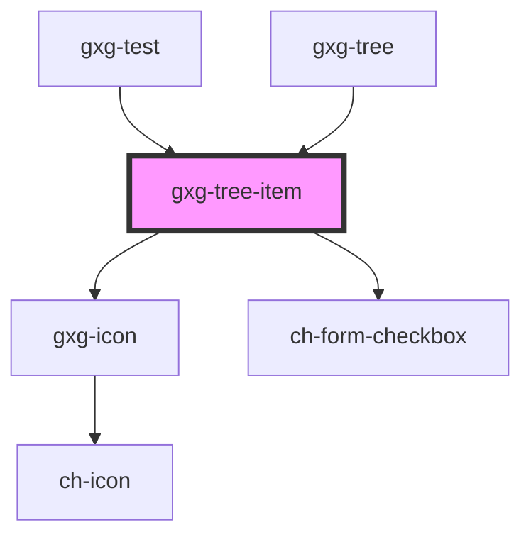

# gxgch-tree-item

<!-- Auto Generated Below -->

## Properties

| Property           | Attribute           | Description                                                                                                                                                                                                                       | Type                 | Default     |
| ------------------ | ------------------- | --------------------------------------------------------------------------------------------------------------------------------------------------------------------------------------------------------------------------------- | -------------------- | ----------- |
| `checkbox`         | `checkbox`          | Set this attribute if you want this item to display a checkbox. This attribute is affected by the parent tree-item checkbox attribute, unless it is set in this item.                                                             | `boolean`            | `undefined` |
| `checked`          | `checked`           | Set this attribute if you want this item to be checked by default. This attribute is affected by the parent tree-item checked attribute, unless it is set in this item.                                                           | `boolean`            | `undefined` |
| `disabled`         | `disabled`          |                                                                                                                                                                                                                                   | `boolean`            | `false`     |
| `download`         | `download`          | Set this attribute if this tree-item has a resource to be downloaded;                                                                                                                                                             | `boolean`            | `false`     |
| `downloaded`       | `downloaded`        | Set this attribute when you have downloaded the resource                                                                                                                                                                          | `boolean`            | `false`     |
| `downloading`      | `downloading`       | Set this attribute when you are downloading a resource                                                                                                                                                                            | `boolean`            | `false`     |
| `firstTreeItem`    | `first-tree-item`   |                                                                                                                                                                                                                                   | `boolean`            | `false`     |
| `hasChildTree`     | `has-child-tree`    |                                                                                                                                                                                                                                   | `boolean`            | `false`     |
| `indeterminate`    | `indeterminate`     |                                                                                                                                                                                                                                   | `boolean`            | `undefined` |
| `isLeaf`           | `is-leaf`           | The presence of this attribute displays a +/- icon to toggle/untoggle the tree                                                                                                                                                    | `boolean`            | `true`      |
| `leftIcon`         | `left-icon`         | Set the left side icon from the available Gemini icon set : https://gx-gemini.netlify.app/?path=/story/icons-icons--controls                                                                                                      | `string`             | `undefined` |
| `masterTree`       | --                  | A reference for the master tree (the first tree). This is only needed if using the model, instead of using common markup.                                                                                                         | `HTMLGxgTreeElement` | `undefined` |
| `opened`           | `opened`            | Set this attribute if you want this items child tree to be opened by default. This attribute is affected by the parent tree-item opened attribute, unless it is set in this item.                                                 | `boolean`            | `undefined` |
| `rightIcon`        | `right-icon`        | Set the right side icon from the available Gemini icon set : https://gx-gemini.netlify.app/?path=/story/icons-icons--controls                                                                                                     | `string`             | `undefined` |
| `selected`         | `selected`          | The presence of this attribute sets the tree-item as selected                                                                                                                                                                     | `boolean`            | `false`     |
| `toggleCheckboxes` | `toggle-checkboxes` | Set this attribute if you want all the children item's checkboxes to be toggled when this item checkbox is toggled. This attribute is affected by the parent tree-item toggleCheckboxes attribute, unless it is set in this item. | `boolean`            | `undefined` |
| `treeModel`        | --                  | This property is for passing a tree structure from the tree.                                                                                                                                                                      | `HTMLGxgTreeElement` | `undefined` |

## Events

| Event                  | Description                                                                                                                                                                 | Type                                             |
| ---------------------- | --------------------------------------------------------------------------------------------------------------------------------------------------------------------------- | ------------------------------------------------ |
| `checkboxClickedEvent` | Emits the checkbox information (chTreeItemData) that includes: the id, name(innerText) and checkbox value.                                                                  | `CustomEvent<{ checked: boolean; id: string; }>` |
| `liItemClicked`        |                                                                                                                                                                             | `CustomEvent<any>`                               |
| `toggleIconClicked`    |                                                                                                                                                                             | `CustomEvent<any>`                               |
| `treeItemLoaded`       | This events emits the id when it has been loaded. IT is useful for the parent tree-items to update, in order to display a toggler icon, or update the vertical line height. | `CustomEvent<string>`                            |

## Methods

### `updateTreeVerticalLineHeight() => Promise<void>`

#### Returns

Type: `Promise<void>`

### `visibleDescendantsNumber() => Promise<number>`

#### Returns

Type: `Promise<number>`

## CSS Custom Properties

| Name                  | Description                    |
| --------------------- | ------------------------------ |
| `--font-family`       | The text font family           |
| `--font-size`         | The text font size             |
| `--font-weight`       | The text font weight           |
| `--guide-color`       | The color of the tree guides   |
| `--item-active-color` | The color of the active item   |
| `--item-hover-color`  | The color of the item on hover |
| `--text-color`        | The color of the text          |

## Dependencies

### Used by

- [gxg-test](../test)
- [gxg-tree](../tree)

### Depends on

- [gxg-icon](../icon)
- ch-form-checkbox

### Graph

---

_Built with [StencilJS](https://stenciljs.com/)_
