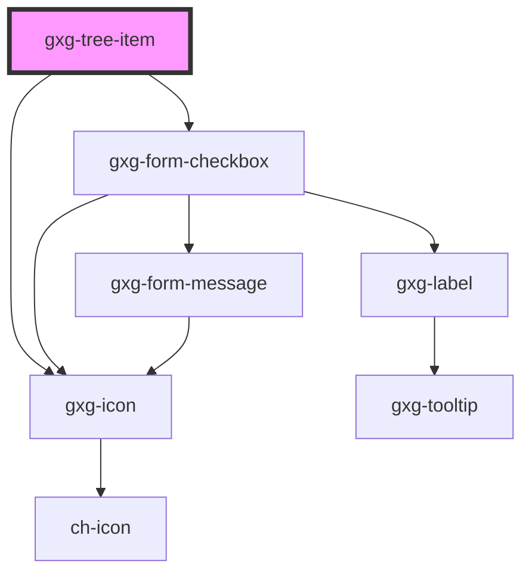

# gxgch-tree-item

<!-- Auto Generated Below -->

## Properties

| Property           | Attribute            | Description                                                                                                                                                                                                                       | Type                 | Default     |
| ------------------ | -------------------- | --------------------------------------------------------------------------------------------------------------------------------------------------------------------------------------------------------------------------------- | -------------------- | ----------- |
| `checkbox`         | `checkbox`           | Set this attribute if you want this item to display a checkbox. This attribute is affected by the parent tree-item checkbox attribute, unless it is set in this item.                                                             | `boolean`            | `undefined` |
| `checked`          | `checked`            | Set this attribute if you want this item to be checked by default. This attribute is affected by the parent tree-item checked attribute, unless it is set in this item.                                                           | `boolean`            | `undefined` |
| `description`      | `description`        | The tree item description.                                                                                                                                                                                                        | `string`             | `undefined` |
| `disabled`         | `disabled`           | The presence of this attribute makes this tree item disabled. This attribute is affected by the parent tree type attribute, unless it is set in this item.                                                                        | `boolean`            | `undefined` |
| `hasChildTree`     | `has-child-tree`     | This property is for internal use. It indicates that the item has children.                                                                                                                                                       | `boolean`            | `false`     |
| `icon`             | `icon`               | Sets the tree item icon                                                                                                                                                                                                           | `string`             | `undefined` |
| `indeterminate`    | `indeterminate`      | This property is for internal use. It indicates that the checkbox has an indeterminate state.                                                                                                                                     | `boolean`            | `false`     |
| `label`            | `label`              | The tree item label.                                                                                                                                                                                                              | `string`             | `undefined` |
| `leaf`             | `leaf`               | The presence of this attribute indicates that this tree-item is a leaf, meaning it has no children items. If is not a leaf, it will display a +/- icon to toggle/ontoggle the children tree                                       | `boolean`            | `false`     |
| `numberOfChildren` | `number-of-children` | This property is for internal use, when using the treeModel.                                                                                                                                                                      | `number`             | `0`         |
| `opened`           | `opened`             | Set this attribute if you want this items child tree to be opened by default. This attribute is affected by the parent tree-item opened attribute, unless it is set in this item.                                                 | `boolean`            | `undefined` |
| `selected`         | `selected`           | The presence of this attribute sets the tree-item as selected                                                                                                                                                                     | `boolean`            | `false`     |
| `toggleCheckboxes` | `toggle-checkboxes`  | Set this attribute if you want all the children item's checkboxes to be toggled when this item checkbox is toggled. This attribute is affected by the parent tree-item toggleCheckboxes attribute, unless it is set in this item. | `boolean`            | `undefined` |
| `treeModel`        | --                   | This property is for passing a tree structure from the tree.                                                                                                                                                                      | `HTMLGxgTreeElement` | `undefined` |
| `type`             | `type`               | This is the tree-item type/category. This attribute is affected by the parent tree type attribute, unless it is set in this item.                                                                                                 | `string`             | `undefined` |

## Events

| Event               | Description                                 | Type                                                                                                                                                                                                                                                                                                                  |
| ------------------- | ------------------------------------------- | --------------------------------------------------------------------------------------------------------------------------------------------------------------------------------------------------------------------------------------------------------------------------------------------------------------------- |
| `checkboxToggled`   | Emitted when the checkbox was toggled       | `CustomEvent<{ ref?: HTMLGxgTreeItemElement; checkbox?: boolean; checked?: boolean; ctrl?: boolean; description?: string; disabled?: boolean; icon?: string; id: string; indeterminate?: boolean; items?: GxgTreeItemData[]; label: string; lazy?: boolean; leaf?: boolean; opened?: boolean; selected?: boolean; }>` |
| `doubleClicked`     | Emitted when the item was double-clicked    | `CustomEvent<{ ref?: HTMLGxgTreeItemElement; checkbox?: boolean; checked?: boolean; ctrl?: boolean; description?: string; disabled?: boolean; icon?: string; id: string; indeterminate?: boolean; items?: GxgTreeItemData[]; label: string; lazy?: boolean; leaf?: boolean; opened?: boolean; selected?: boolean; }>` |
| `lazyChanged`       | Emitted when the item is not lazy anymore   | `CustomEvent<{ ref?: HTMLGxgTreeItemElement; checkbox?: boolean; checked?: boolean; ctrl?: boolean; description?: string; disabled?: boolean; icon?: string; id: string; indeterminate?: boolean; items?: GxgTreeItemData[]; label: string; lazy?: boolean; leaf?: boolean; opened?: boolean; selected?: boolean; }>` |
| `selectionChanged`  | Emitted when the icon selection was changes | `CustomEvent<{ ref?: HTMLGxgTreeItemElement; checkbox?: boolean; checked?: boolean; ctrl?: boolean; description?: string; disabled?: boolean; icon?: string; id: string; indeterminate?: boolean; items?: GxgTreeItemData[]; label: string; lazy?: boolean; leaf?: boolean; opened?: boolean; selected?: boolean; }>` |
| `toggleIconClicked` | Emitted when the toggle icon was clicked    | `CustomEvent<{ ref?: HTMLGxgTreeItemElement; checkbox?: boolean; checked?: boolean; ctrl?: boolean; description?: string; disabled?: boolean; icon?: string; id: string; indeterminate?: boolean; items?: GxgTreeItemData[]; label: string; lazy?: boolean; leaf?: boolean; opened?: boolean; selected?: boolean; }>` |

## Methods

### `evaluateCheckboxStatus() => Promise<void>`

#### Returns

Type: `Promise<void>`

### `reRender() => Promise<void>`

#### Returns

Type: `Promise<void>`

## CSS Custom Properties

| Name                  | Description                    |
| --------------------- | ------------------------------ |
| `--font-family`       | The text font family           |
| `--font-size`         | The text font size             |
| `--font-weight`       | The text font weight           |
| `--guide-color`       | The color of the tree guides   |
| `--item-active-color` | The color of the active item   |
| `--item-hover-color`  | The color of the item on hover |
| `--text-color`        | The color of the text          |

## Dependencies

### Depends on

- [gxg-icon](../icon)
- [gxg-form-checkbox](../form-checkbox)

### Graph

---

_Built with [StencilJS](https://stenciljs.com/)_
