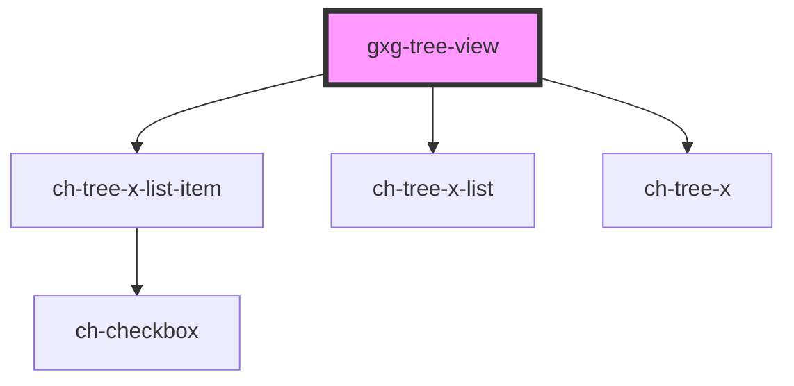

# gxg-tree-view

<!-- Auto Generated Below -->

## Properties

| Property                     | Attribute         | Description                                                                                                             | Type                                                                                                       | Default         |
| ---------------------------- | ----------------- | ----------------------------------------------------------------------------------------------------------------------- | ---------------------------------------------------------------------------------------------------------- | --------------- |
| `checkDroppableZoneCallback` | --                | Callback that is executed when an element tries to drop in another item of the tree. Returns whether the drop is valid. | `(dropInformation: TreeXDataTransferInfo) => Promise<boolean>`                                             | `undefined`     |
| `dropItemsCallback`          | --                | Callback that is executed when a list of items request to be dropped into another item.                                 | `(dataTransferInfo: TreeXDataTransferInfo) => Promise<{ acceptDrop: boolean; items?: TreeXItemModel[]; }>` | `undefined`     |
| `lazyLoadTreeItemsCallback`  | --                | Callback that is executed when a item request to load its subitems.                                                     | `(treeItemId: string) => Promise<TreeXItemModel[]>`                                                        | `undefined`     |
| `modifyItemCaptionCallback`  | --                | Callback that is executed when a item request to modify its caption.                                                    | `(treeItemId: string, newCaption: string) => Promise<TreeXOperationStatusModifyCaption>`                   | `undefined`     |
| `multiSelection`             | `multi-selection` | Set this attribute if you want to allow multi selection of the items.                                                   | `boolean`                                                                                                  | `false`         |
| `showLines`                  | `show-lines`      | `true` to display the relation between tree items and tree lists using lines.                                           | `"all" \| "last" \| "none"`                                                                                | `"none"`        |
| `sortItemsCallback`          | --                | Callback that is executed when the treeModel is changed to order its items.                                             | `(subModel: TreeXItemModel[]) => void`                                                                     | `undefined`     |
| `treeModel`                  | --                | This property lets you define the model of the ch-tree-x control.                                                       | `{ items: TreeXItemModel[]; multiSelection?: boolean; showLines?: boolean; }`                              | `{ items: [] }` |

## Methods

### `scrollIntoVisible(treeItemId: string) => Promise<void>`

Given an item id, it displays and scrolls into the item view.

#### Returns

Type: `Promise<void>`

### `toggleItems(treeItemIds: string[], expand?: boolean) => Promise<TreeXListItemExpandedInfo[]>`

This method is used to toggle a tree item by the tree item id/ids.

#### Returns

Type: `Promise<TreeXListItemExpandedInfo[]>`

### `updateAllItemsProperties(properties: { expanded?: boolean; checked?: boolean; }) => Promise<void>`

Given a subset of item's properties, it updates all item UI models.

#### Returns

Type: `Promise<void>`

### `updateItemsProperties(items: string[], properties: TreeXItemModel) => Promise<void>`

Given a item list and the properties to update, it updates the properties
of the items in the list.

#### Returns

Type: `Promise<void>`

## Dependencies

### Depends on

- ch-tree-x-list-item
- ch-tree-x-list
- ch-tree-x

### Graph

---

_Built with [StencilJS](https://stenciljs.com/)_
