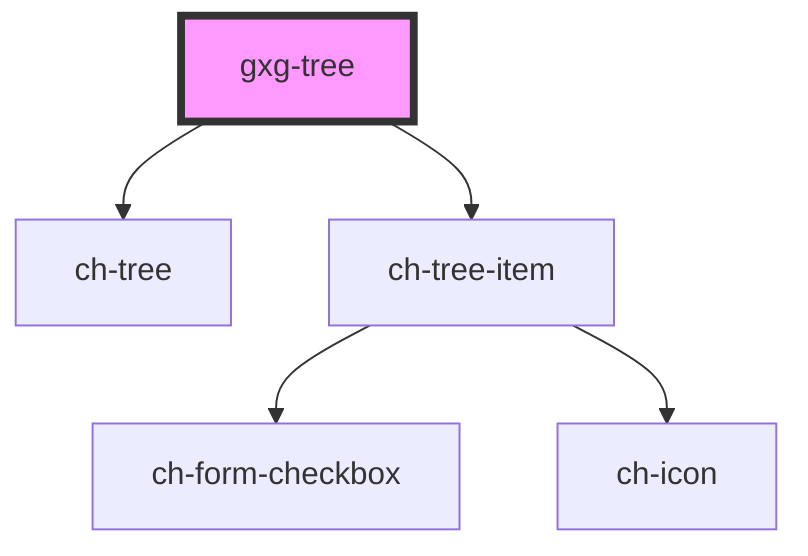

# gxgch-tree

<!-- Auto Generated Below -->

## Properties

| Property   | Attribute   | Description                                                 | Type                                                                     | Default                                                       |
| ---------- | ----------- | ----------------------------------------------------------- | ------------------------------------------------------------------------ | ------------------------------------------------------------- |
| `basePath` | `base-path` | The base path for Gemini icon assets.                       | `string`                                                                 | `"/build/icon-assets/"`                                       |
| `config`   | --          | The base/parent tree configuration.                         | `{ checkbox?: boolean; checked?: boolean; toggleCheckboxes?: boolean; }` | `{ checkbox: true, checked: false, toggleCheckboxes: true, }` |
| `model`    | --          | The tree model (optional). An array of GxgTreeItem's items. | `GxgTreeItem[]`                                                          | `undefined`                                                   |

## Dependencies

### Depends on

- ch-tree
- ch-tree-item

### Graph

---

_Built with [StencilJS](https://stenciljs.com/)_
