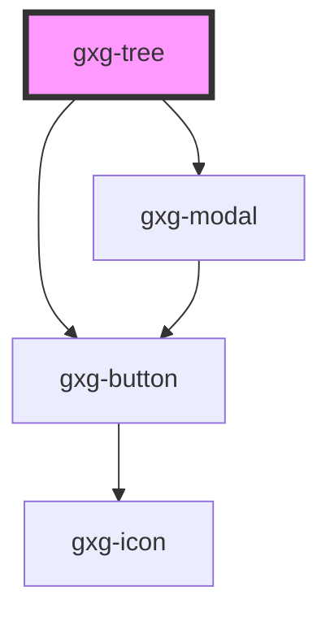

# gxg-test

<!-- Auto Generated Below -->

## Properties

| Property   | Attribute  | Description                                                                          | Type      | Default |
| ---------- | ---------- | ------------------------------------------------------------------------------------ | --------- | ------- |
| `checkbox` | `checkbox` | Set this attribute if you want all this tree tree-items to have a checkbox           | `boolean` | `false` |
| `checked`  | `checked`  | Set this attribute if you want all this tree tree-items to have the checkbox checked | `boolean` | `false` |

## Dependencies

### Depends on

- [gxg-modal](../modal)
- [gxg-button](../button)

### Graph

---

_Built with [StencilJS](https://stenciljs.com/)_
