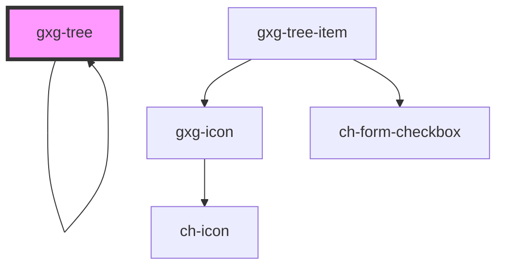

# gxgch-tree

<!-- Auto Generated Below -->

## Properties

| Property           | Attribute           | Description                                                                                                          | Type                | Default     |
| ------------------ | ------------------- | -------------------------------------------------------------------------------------------------------------------- | ------------------- | ----------- |
| `checkbox`         | `checkbox`          | Set this attribute if you want all the items to have a checkbox.                                                     | `boolean`           | `true`      |
| `checked`          | `checked`           | Set this attribute if you want all the items to be checked by default.                                               | `boolean`           | `false`     |
| `model`            | --                  | A model of the tree. Use this if you prefer to use a model instead of markup directly.                               | `GxgTreeItemData[]` | `undefined` |
| `opened`           | `opened`            | Set this attribute if you want all the items to be opened by default.                                                | `boolean`           | `true`      |
| `toggleCheckboxes` | `toggle-checkboxes` | Set this attribute if you want all the items checkboxes to be toggled when the parent tree item checkbox is toggled. | `boolean`           | `false`     |

## Methods

### `getChecked(idsArray?: (string | number)[]) => Promise<CheckedGxgTreeItem[]>`

#### Returns

Type: `Promise<CheckedGxgTreeItem[]>`

### `toggleItems(ids: string[], open?: boolean) => Promise<ToggledGxgTreeItem[]>`

#### Returns

Type: `Promise<ToggledGxgTreeItem[]>`

## Dependencies

### Used by

- [gxg-tree](.)

### Depends on

- [gxg-tree](.)
- [gxg-tree-item](../tree-item)

### Graph

---

_Built with [StencilJS](https://stenciljs.com/)_
