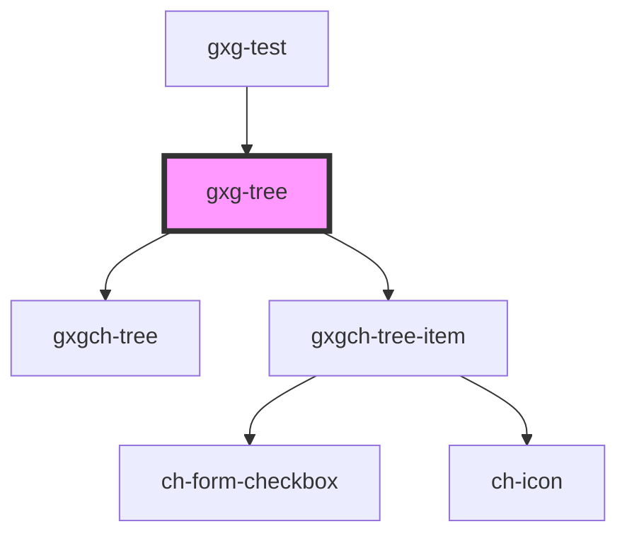

# gxg-tree

<!-- Auto Generated Below -->

## Properties

| Property   | Attribute   | Description                                                 | Type                                                                                      | Default                 |
| ---------- | ----------- | ----------------------------------------------------------- | ----------------------------------------------------------------------------------------- | ----------------------- |
| `basePath` | `base-path` | The base path for Gemini icon assets.                       | `string`                                                                                  | `"/build/icon-assets/"` |
| `config`   | --          | The base/parent tree configuration.                         | `{ checkbox?: boolean; checked?: boolean; toggleCheckboxes?: boolean; opened: boolean; }` | `{ opened: true, }`     |
| `model`    | --          | The tree model (optional). An array of GxgTreeItem's items. | `GxgTreeItem[]`                                                                           | `undefined`             |

## Methods

### `getChecked() => Promise<any[]>`

#### Returns

Type: `Promise<any[]>`

## Dependencies

### Used by

- [gxg-test](../test)

### Depends on

- [gxgch-tree](../gxgch-tree)
- [gxgch-tree-item](../gxgch-tree-item)

### Graph

---

_Built with [StencilJS](https://stenciljs.com/)_
