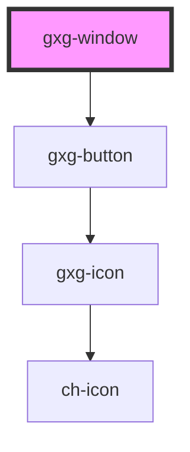

# gxg-window

<!-- Auto Generated Below -->

## Properties

| Property    | Attribute    | Description            | Type     | Default     |
| ----------- | ------------ | ---------------------- | -------- | ----------- |
| `maxHeight` | `max-height` | The window max. height | `string` | `"100%"`    |
| `maxWidth`  | `max-width`  | The window max. width  | `string` | `"100%"`    |
| `minHeight` | `min-height` | The window min. height | `string` | `undefined` |
| `minWidth`  | `min-width`  | The window min. width  | `string` | `undefined` |

## Dependencies

### Depends on

- [gxg-button](../button)

### Graph

---

_Built with [StencilJS](https://stenciljs.com/)_
